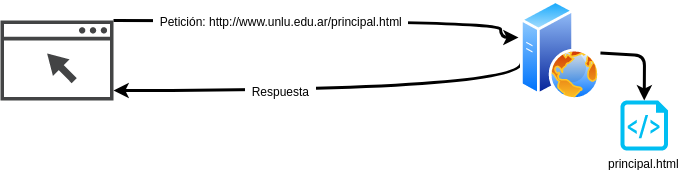
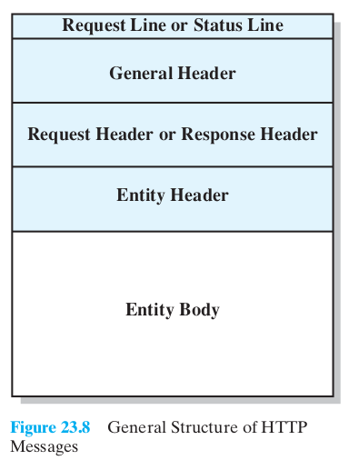
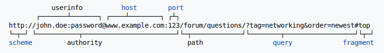
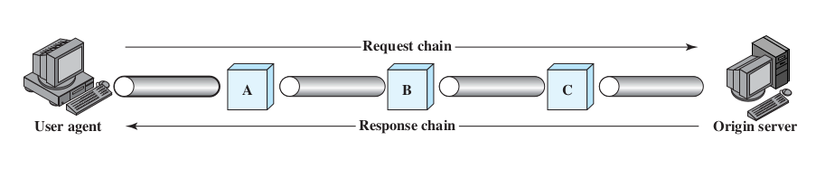
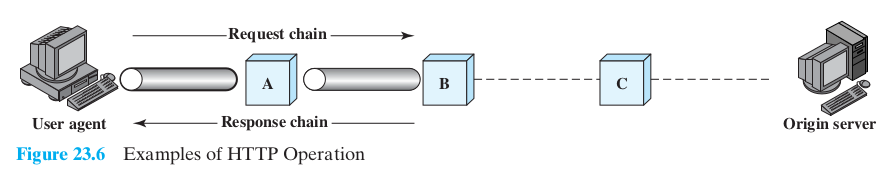
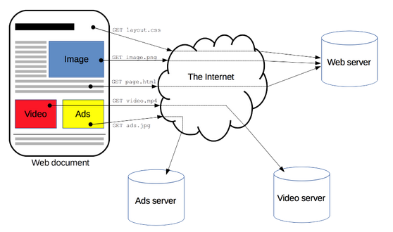
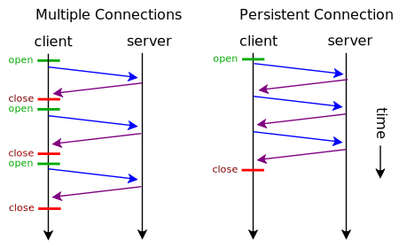
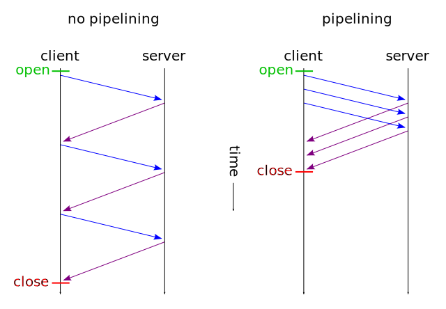
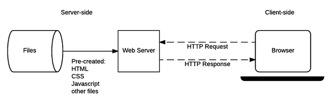
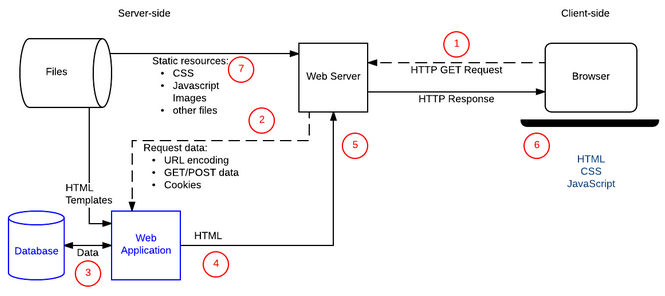

Protocolo HTTP
==========================

## Temario

- Por qué ver este protocolo? → 53 % del tráfico en América Latina (2016)
- Arquitectura cliente/servidor → UA, Web server
  - Historia: CERN 1989, Tim Berners Lee, Hipervínculos, HTTP/0.9 '91
- HyperText Transfer Protocol HTTP 1.0 - IETF '96 – RFC 1945
- Características de HTTP según Comer:
  - Capa 7, Petición/Respuesta, Sin estado, Bidireccional, Negociación, Intermediarios, Caché
- HyperText Markup Language HTML – CERN '91
- La web como sistema distribuido (concepto de URL, Recurso, Entidad, etc)
- Páginas estáticas
- Formato de la petición
  - Request Line / Status Line
  - Encabezados
    - Encabezados generales, Encabezados de Request y Encabezados de Entidad
  - Cuerpo de la Entidad
  - Rol de MIME
- Códigos de estado y error 1xx, 2xx, 3xx, 4xx, 5xx
- Procesamiento del lado del servidor
- Common Gateway Interface NCSA '93 – RFC 3875
  - Common Gateway Interface (direccion URL y variables)
  - Método HTTP GET (entrada/salida)
  - Método HTTP POST (entrada/salida)
  - Common Gateway Interface (status, content-type, location, body)
  - Ejemplo de código PHP
  - Common Gateway Interface
- Mantenimiento de información de estado
  - Cookies (Netscape '94, RFC 2965)
- Javascript (Netscape '96, W3C '96)
- Cascading StyleSheets (Netscape '96, W3C '96)
- HTML 5 (WHATGW '04, W3C '09~'22?)
  - HTML 5 Características

## Introducción

HTTP es un protocolo de capa de aplicación encargado de dar soporte a todo lo que hoy en dia se conoce como "la web". Inicialmente se trataba de un protocolo orientado a compartir información de manera que la misma pueda ser "navegable" entre si.

La estandarización y simplicidad del protocolo fue un factor clave a la hora de volverse popular, llegando a la actualidad de ser uno de los servicios en Internet mas utilizados.

Como servicio de capa de aplicación, es utilizado directamente por el usuario final, a traves de software especializado conocido como User-Agent. En particular los conocidos Web Browsers son el caso de uso mas conocido.

HTTP viene de HyperText Transfer Protocol.

## Historia

HTTP tuvo diversas versiones.

* HTTP 0.9 (1991): La primer versión creada en el CERN por Tim Berners-Lee.
* HTTP 1.0 (1996): Versión estable obsoleta detallada en el RFC 1945.
* HTTP 1.1 (1997): Versión estable aun en uso descripta en RFC 2068.
  * Update en RFC 2616 (1999)
  * Un conjunto de RFCs dejan obsoletos los anteriores: 7230, 7231, 7232, 7233, 7234, 7235.
* HTTP 2 (2015): was published as RFC [7540](https://tools.ietf.org/html/rfc7540).
* HTTP 3 (2018-Future?)

Esta clase refiere a HTTP/1.1 en su versión mas moderna.

## Definiciones

- Cliente / Servidor
  - Web Server
  - Web Client
- Usa servicios de TCP para garantizar fiabilidad
  - Requiere entonces que una conexión TCP sea establecida entre cliente y servidor previo al intercambio de cualquier PDU.
- Protocolo sin estado: No existe relación alguna entre una transacción y la siguiente
- La PDU de HTTP es conocida como "Mensaje"
  - Un mensaje que viaja del cliente al servidor es una "petición"
  - Un mensaje que viaja desde el servidor al cliente es una "respuesta"
  - PDU variable y orientada al "texto plano"
- Se dice que el cliente juega un rol "activo" y el servidor un rol "pasivo"
- Los diferentes headers le permiten manejar diversos formatos, que puede ser una web en HTML, una imagen en png, un video en mp4, por nombrar algunos ejemplos.
- Cada elemento referible en la web es conocido como "Recurso". En general un recurso disponible en la web es localizable via un identificador, que se conoce como URL.

## Escenarios

### Escenario 1

Se desea recuperar un archivo .html desde un servidor web donde se encuentra alojado el mismo. Existe una url (http://www.unlu.edu.ar/principal.html) para acceder al mismo.



¿Como sucede el intercambio?

* Usuario inicia el Web Browser
* Coloca la dirección en la barra de direcciones
* Cliente utiliza servicios de DNS para definir la IP del server www.unlu.edu.ar
* Cliente inicia una conexión TCP con el servidor
* UA genera un mensaje de petición del documento principal.html y lo envia al server
* Servidor recibe la peticion
* Servidor localiza el archivo en su Filesystem
* Server genera un mensaje de respuesta que envia al cliente
* Se cierra la conexión

¿Que elementos intervinieron?

#### Cliente

Acepta en su interfaz URL del recurso a solicitar; Puede utilizar servicios de DNS; Genera peticiones HTTP y Procesa Respuestas.

#### Mensajes

PDU de HTTP.




Petición Headers

```http
GET /principal.html HTTP/1.1\r\n
Host: www.unlu.edu.ar\r\n
User-Agent: Mozilla/5.0 (X11; Ubuntu; Linux x86_64; rv:68.0) Gecko/20100101 Firefox/68.0\r\n
Accept: text/html,application/xhtml+xml,application/xml;q=0.9,*/*;q=0.8\r\n
Accept-Language: es-AR,en;q=0.7,en-US;q=0.3\r\n
Accept-Encoding: gzip, deflate\r\n
Referer: http://www.unlu.edu.ar/oferta.html\r\n
DNT: 1\r\n
Connection: keep-alive\r\n
Upgrade-Insecure-Requests: 1\r\n
Pragma: no-cache\r\n
Cache-Control: no-cache\r\n
\r\n
```

Cabeceras de Respuesta

```http
HTTP/1.1 200 OK\r\n
Date: Fri, 30 Aug 2019 23:26:06 GMT\r\n
Server: Apache\r\n
Vary: Accept-Encoding\r\n
Content-Encoding: gzip\r\n
Content-Length: 7922\r\n
Keep-Alive: timeout=5, max=100\r\n
Connection: Keep-Alive\r\n
Content-Type: text/html; charset=iso-8859-1\r\n
\r\n
[BODY]
```

* General Headers: Headers que aplican a ambos request y response
  * Date
  * Connection (keep-alive y close)
  * Keep-Alive
  * Cache-Control
* Request Headers: Headers que solo deben ser incluidos en una peticion o datos del cliente
  * Accept
  * Accept-Language
  * Accept-Encoding
  * Host
  * User-Agent
* Response Headers: Cabeceras validas en una respuesta
  
  * Server
* Entity Headers: Información sobre el recurso que va en el body
  * Content-Encoding
  * Content-Length
  * Content-Type
* Entity Body: El cuerpo del mensaje (Los datos que solicito el usuario)

* URL: Identificador de recursos. Dirección que permite referenciar un recurso en un servidor.

  

#### Métodos

También llamados comandos, indican la acción que el cliente desea realizar sobre el recurso en el servidor. Existen muchos, entre ellos:

GET: Una petición GET solicita el recurso al servidor que se indica en la URL

POST: Una petición que le indica al servidor que "acepte" la entidad que va adjunta al mensaje, según se indique en la URL de la petición como sub recurso. P.e. `POST /articulos HTTP/1.1` creara un articulo nuevo (p.e. /articulos/new-article.html). Si el recurso existe, es una actualización.

PUT: Petición que adjunta una entidad desde el cliente para que el servidor la almacene y le permita ubicarla desde la URL indicada. P.e. `PUT /articulos/some-article.html` lo crea si existe, sino actualiza. DIFERENCIA con POST: Con post, hacer `POST /articulos/new-article HTTP/1.1` no es correcto.

DELETE: En general no se usa, elimina el recurso especificado.

HEAD: Similar a GET, pero solo devuelve el header del response (es util para solicitar información del recurso sin que comience la descarga del mismo).

OPTIONS, PATCH, TRACE.

#### Servidor

Es un host o dispositivo que acepta mensajes de petición HTTP, conoce la manera de procesarlo y puede generar respuestas adecuadas.  Típicamente el servidor esta disponible en el puerto 80. Algunos software de servidor tipicos son Apache2, nginx, IIS.

El servidor procesa la petición y según la petición realizada y el estado del servidor, existe un código de respuesta, similar a los vistos en el caso de Mail. Ejemplos de Códigos de error utilizados en HTTP.

* Códigos de información: 1XX. En general de uso experimental o testing.
* Códigos de éxito: 2XX.

  * 200 Ok.
  * 201 Created.
  * 202 Accepted.
* Códigos de redirección: 3XX. Usando Header Location se puede ir al nuevo objeto.

  * 301 Moved Permanently
  * 302 Moved Temporarily
* Códigos de error de Cliente: 4XX.
  * 400 Bad Request
  * 401 Unauthorized
  * 403 Forbidden
  * 404 Not Found
* Códigos de error de Servidor: 5XX.
  * 500 Internal Server Error

### Escenario 2



El servidor que posee el recurso que desea el usuario es ahora conocido como `origin server`. El UA construye la petición de forma similar a la vista anteriormente pero la misma es enviada a un dispositivo intermedio. Este dispositivo procesa la petición, detecta cual es el origin server, y genera una nueva petición hacia el.

3 tipos de sistemas intermedios son conocidos en HTTP:

Los proxys, los gateways y los túneles.

Gateway habitualmente nos habla de un dispositivo que permite que 2 dispositivos hablen en diferentes protocolos. Asi por ejemplo, el UA podía hacer peticiones en HTTP, y el gateway hacia el server usaba otro protocolo, p.e. FTP o HTTP2.

Un túnel es cuando un protocolo se encapsula dentro de otro que habitualmente no lo haría, generalmente por razones de restricciones. Por ejemplo, tunelizar HTTP en SSH porque una organización permite trafico ssh pero no http.

#### Proxy

Proxy es un dispositivo que permite recibir, procesar y reenviar peticiones HTTP entre clientes y servidores. Para el cliente, el proxy es un servidor, y para el origin server, el proxy es un cliente. Es habitual su uso para establecer políticas de seguridad, restricciones de acceso, monitoreo de trafico, entre otros.

Es interesante notar que tanto el cliente como el servidor son conscientes de la existencia del proxy. En el cliente este debe ser configurado (sección proxy en los navegadores). En el caso del servidor, el proxy agrega cabeceras que lo identifican como tal. Es habitual que el proxy escuche en el puerto 3128 o 8080.

  * Forwarded
  * X-Forwarded-Host
  * Via

Escenarios de implementación de un proxy:

1. El proxy opera dentro de los limites de la organización, de manera que los clientes no pueden realizar conexiones TCP (y por ende HTTP) hacia el exterior, pero si hasta el proxy. De esta manera, el proxy si tiene permitido conexiones al exterior y es a través de este que se realizan las peticiones de los clientes de la organización.
2. Un usuario desea ocultarse tras un proxy para anonimizar su navegación. Contrata o instala un proxy en un servidor externo, y se conecta a través de este para operar hacia la web. Proxy anónimo.
3. Una organización desea que sus clientes se conecten a un sistema que se encuentra en N servidores, de manera que el cliente 1 se conecte al server 1, el cliente 2 lo haga al server 2, el cliente N lo haga al server N, el cliente N+1 lo haga al 1, y así. Un proxy puede implementar este tipo de políticas, y este servicio es conocido como proxy reverso.
4. Una organización dispone de un acceso autorizado a traves de una IP a un servicio de pago, pero tiene N user-agents distribuidos por todo el edificio que requieren usar el servicio. Si se autoriza la IP del proxy, los clientes pueden acceder a través de este de forma cómoda.

### Escenario 3



#### Cache

Capacidad de un dispositivo diferente del servidor de origen de retornar el recurso solicitado por el UA sin la necesidad de que la petición sea enviada a dicho servidor.

El objetivo de una cache es optimizar el tiempo de respuesta para recursos que ya fueron recuperados y se tiene la seguridad de que no han cambiado en algún tiempo.

El UA puede realizar cache, así como también los proxys pueden hacerlo.

En general, una petición es cacheada y si una próxima petición solicita idéntico recurso (via URL), el objeto almacenado local es devuelto.

Los clientes y servidores pueden indicar (mediante headers específicos) si un recurso puede ser cacheado o no, y por cuanto tiempo.

* Cache-Control: no-store | public | max-age=\<seconds\>

Una CDN es un cache distribuido, que permite tener elementos con cache cerca de los usuarios, y regula que las copias se encuentren consistentes si el creador de contenido realiza un cambio.

### Escenario 4



Una pagina web consiste de un conjunto de recursos (u objetos). Cada objeto, por protocolo, debe ser solicitado a través de una petición. Supongamos entonces que se tiene un sitio www.example.com, el cual cuenta con un vídeo y 2 imágenes. Ademas, el sitio tiene una hoja de estilos css en un archivo layout.css.

Lo primero que se solicita es el sitio, se genera vía un mensaje GET. Se abre la conexión TCP, se genera el mensaje, se recibe la respuesta, se cierra la conexión, y el UA comienza a procesar el HTML recibido.

#### Keep-Alive

Por cada objeto que encuentra, en HTTP/1.0 se abría una conexión TCP hacia el servidor, se realizaba el ciclo petición/respuesta, y se cerraba la conexión. Luego apareció la posibilidad de establecer opcionalmente que la conexión sea persistente mediante el método Keep-Alive.

A partir de HTTP/1.1, Keep-Alive es considerado el comportamiento por default. Esta cabecera permite tanto al cliente como al servidor especificar que la conexión TCP subyacente no se cierre al finalizar la transferencia de la respuesta, sino que espere (por un tiempo) por si el cliente necesita solicitar nuevos recursos al mismo servidor, ademas de parámetros adicionales para manejar la conexión.

```http
Keep-Alive: timeout=5, max=1000
```

#### Conexiones múltiples y persistentes



Existían consideraciones de diseño en general, que hacían que las múltiples conexiones fueran una mala practica. P.e. debido a que el RFC 2616, en la sección 8.1.4 recomienda que no se establezcan mas de 2 conexiones por UA contra un mismo dominio. Con el paso del tiempo este numero ascendió a 4 o 6 en algunos casos. Esto genera el "famoso efecto" cascada cuando se monitorea la descarga de un sitio web, donde conexiones paralelas descargan varios objetos, pero igualmente necesitan esperar cierto tiempo para empezar a descargar las siguientes.

En general, esto se debe a que el sitio aloja todos los objetos en el mismo server.

Diversos enfoques se buscaron para superar estos limites, HTTP Pipeling o Web farming



source: wikipedia

Web farming consiste en tener disponibles N servidores con los objetos disponibles, de manera que cuando un recurso HTML es devuelto, las urls pasadas se devuelven de manera que se bajen solo las permitidas por servidor.

#### Tipos de recursos

Como se observa en este escenario, diversidad de recursos pueden ser descargados y mostrados en una pagina web. Desde contenido basado en texto (html, css, js), hasta objetos multimedia (imágenes, video).

**Estáticos**



source: MDN

Se considera contenido estático a todo aquel recurso que se encuentra alojado en un servidor y puede ser devuelto sin que dicho server realice ninguna operación mas que agregarlo como cuerpo de la respuesta.

Para el caso de los archivos basados en texto, alcanza con agregar el contenido despues de terminada la zona de cabecera (doble \r\n), y ademas identificar el tipo de contenido con el header Content-Type:

* Content-Type: text/html
* Content-Type: text/css
* Content-Type: text/js

**Tipos MIME**

De la misma forma que en mail se pueden utilizar extensión MIME para enviar diferentes tipos de adjuntos, en HTTP se pueden enviar archivos binarios.

Para lograrlo, tener en cuenta que ha diferencia del mail, donde los "adjuntos" están incluidos junto con sus cabeceras en el mismo mensaje, en HTTP cada mensaje es un recurso, y su Content-Type identifica el recurso que viene en el área del cuerpo. Algunos tipos clásicos:

* Content-Type: image/png
* Content-Type: image/jpeg
* Content-Type: video/webm
* Content-Type: application/pdf

Para transportar el contenido de estos archivos binarios, la extensión MIME define metodos de codificación (por ejemplo base64) que permiten tomar archivos binarios y codificarlos en texto. 

Existen otros headers que permiten el manejo de tipos MIME:

* Content-Encoding: gzip
* Content-Length: NNNN (bytes)

#### Protocolo sin Estado

Algo mencionado anteriormente, el protocolo HTTP no tiene "estados". Esto significa que, por diseño de protocolo, una serie de peticiones realizadas por el mismo cliente no tienen ningún tipo de relación para el servidor, y son procesadas de forma independiente. No comparten variables, se ejecutan en hilos o procesos separados, y no requieren que una termine de completarse para avanzar con la otra.

Un error común es confundir el esquema stateless con falta de autenticación, sesiones o login. HTTP si permite restricciones de acceso o login vía ciertos headers. Pero lo dicho en el párrafo anterior se sigue cumpliendo. El servidor puede completar la resolución de una petición con la información contenida en dicha petición, o mostrar un mensaje de error.

Es el cliente quien debe mostrar la pagina y todos sus recursos de forma "integrada". De hecho, el cliente puede optar por ignorar ciertos tipos de recursos (un navegador por consola no solicitar imágenes, o un plugin de bloqueo de anuncios impedir la descarga de ciertos scripts, videos o imágenes). Al servidor le resulta indistinto si se solicitan todos los recursos de una página o una porción de los mismos.

### Escenario 5

Web Pages <--> Web Sites <--> Web Applications



source: MDN

El contenido HTML devuelto por el web server es creado vía scripting o lenguaje de programación de forma dinámica, y puede variar según ubicación geográfica, parámetros de la petición, datos en una base de datos, etc...

El contenido devuelto, en su gran mayoría, no existe previamente almacenado, sino que es el resultado de un proceso lanzado por el servidor. Por ello también se conoce como server-side programming o backend programming.

A lo largo del tiempo, muchos enfoques se han propuesto para esta programación server-side. Un rápido repaso por alguna de estas técnicas:

* CGI (Common Gateway Interfaces): Definido en RFC 3875, permitía que se ejecute un proceso, lanzado por el web server, y se le pasen un conjunto de variables de entorno para que el script procese y genere la salida, por salida estándar, que era capturada por el servidor web y devuelta como respuesta al cliente. La salida del script debía consistir tanto en el header como el body de la respuesta. Existían un conjunto de variables de entorno que se encontraban disponibles en el script (p.e. el header User-Agent se almacenaba en HTTP_USER_AGENT y el header Content-Type en HTTP_CONTENT_TYPE), pero también el entorno proporcionaba información del servidor. En el caso de ser una petición con body (caso POST o PUT), la misma era ingresada por entrada estándar. Este esquema permitió que por primera vez se pudieran usar diferentes lenguajes para generar el contenido dinámico.
* Módulos de Servidor: Un enfoque mas moderno es el uso de módulos que permiten al servidor algo similar a lo que se hacia con CGI. La ventaja es que se pueden utilizar métodos mas seguros, y que aceptan mas tipos de configuración (CGI era famoso por diversos tipos de vulnerabilidades y limitaciones). En la actualidad se puede configurar el web server para que use procesos o hilos según sea adecuado. La idea era que vía el modulo, el servidor web "sepa" como ejecutar el script en cuestión y pasarle los archivos adicionales.
* WSGI es un enfoque mas moderno, donde se construye una aplicación que tenga una parte que interactua con el servidor conocida como server/gateway side, y una parte especifica de la aplicación conocida como application/framework side.
* FastCGI y FPM: Formas alternativas de uso de CGI, que mejoran vía propiedades del sistema operativo la utilización de los recursos, como el rehúso de conexiones TCP, variables de entorno, etc... La idea es mejorar el rendimiento en el procesamiento de las peticiones, permitiendo al servidor web atender mas peticiones utilizando la misma cantidad de recursos.

