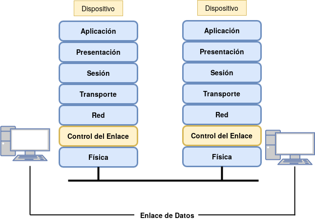
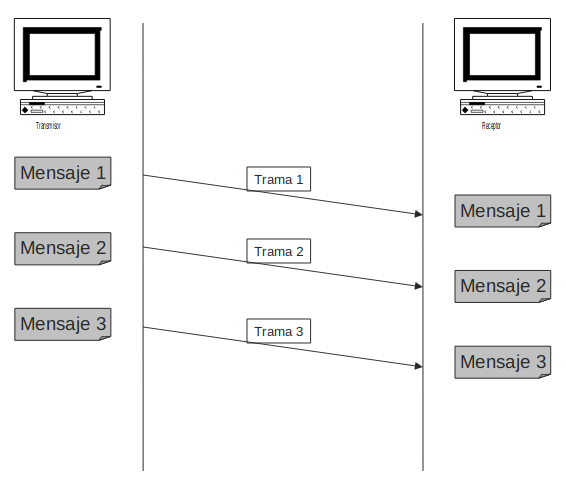
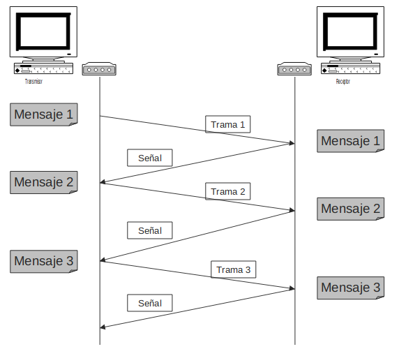
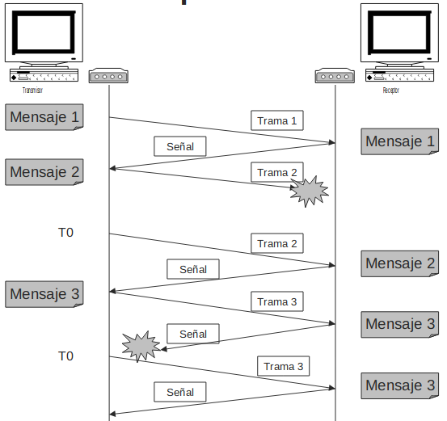
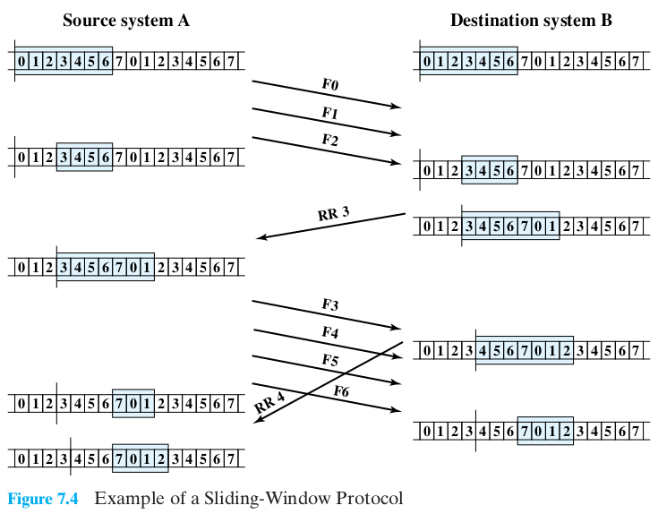
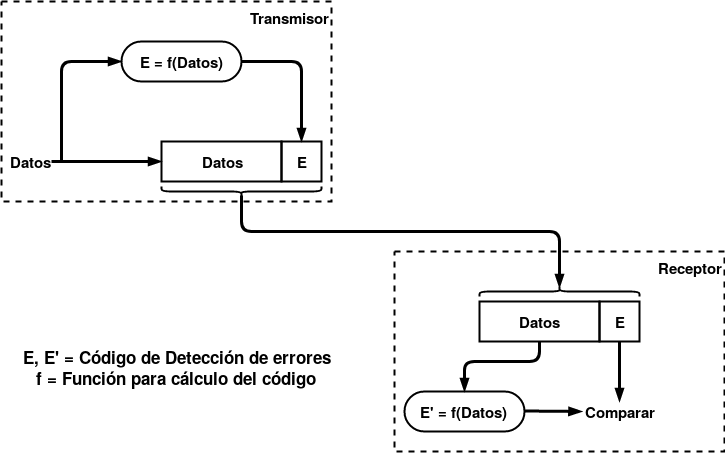
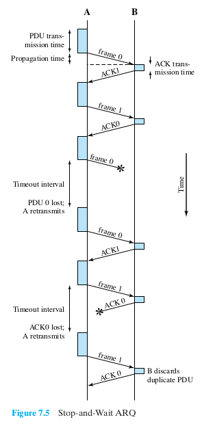
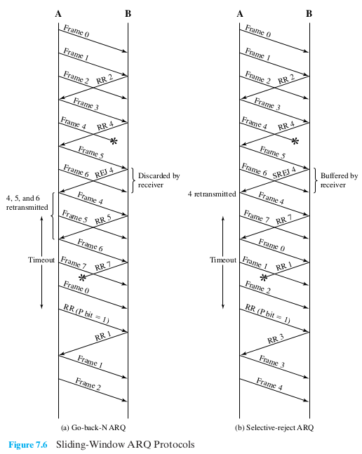

# Control del Enlace

## Puntos claves

* Capa 2 del modelo OSI y TCP / IP
* Capa 1 resuelve transmisión de datos y sincronización. Sin embargo eso no alcanza para comunicar de forma "fiable". Errores y Congestión del receptor. 
* Crear la ilusión de un enlace confiable, o fiable, entre adyacentes es el objetivo de la capa 2.
* Es un conjunto de procedimientos para gestionar y controlar el intercambio entre dispositivos adyacentes.
* 2 objetivos primarios: Control de flujo y control de enlace.

## Introducción

Es la capa 2 del modelo OSI:

Para enviar datos sobre un medio, existen muchos factores a considerar ademas de los considerados en la Capa 1 (sincronización de dispositivos, conversión de datos en señales). A todas esas actividades y mecanismos que permiten que la comunicación se realice de forma confiable se los engloba en la capa de control del enlace. Cuando un protocolo de control de enlace se utiliza entre dispositivos, el medio se denomina "enlace de datos".

La secuencia de bits que circulan por el enlace de datos se dividen en bloques, a los que se llama **tramas** o frames y es la unidad de transmisión de datos en capa 2.

Entre estos requerimientos / objetivos se pueden mencionar:

* Sincronización de tramas: División de los datos a ser enviados en "bloques" conocidos como frame o tramas, cuyo principio y final deben distinguidos por el receptor.
* Control de Flujo: La estación que envía datos no debe hacerlo a una velocidad mayor de la que la estación receptora pueda recibirlos.
* Control de errores: Corrección de errores introducidos por el sistema de transmisión.
* Direccionamiento: En un medio compartido, p.e. LAN, las estaciones deben poder identificarse y especificarse.
* Datos y control en el mismo enlace: Tener un enlace único para control y datos, y que el receptor pueda distinguir uno de otro.
* Gestión del enlace: Procedimientos generales para el inicio, mantenimiento y finalización del intercambio de datos pueden ser necesarios o requeridos para la comunicación entre los dispositivos.

## Contexto

Medios: Imperfectos (ruido, atenuación); capacidad finita (ancho de banda); Retardo de propagación (distancia). -> Posibilidad de errores.

Emisor/Receptor: Tiempos de procesamiento; Tamaño de buffers. -> Control de Flujo.

## Control de Flujo

Procedimientos y técnicas para que el emisor no sobrecargue al receptor de datos.

El receptor tiene buffers para mantener la información recibida durante el procesamiento de la misma, antes de pasarla a capas superiores. Estos buffers pueden llenarse si se reciben datos a una tasa mayor de la velocidad de procesamiento. Si los buffers se llenan, el receptor empieza a descartar tramas.

El control de flujo debe garantizar que el receptor siempre tiene espacio disponible para recibir nuevos datos.

### Escenarios

* Se transmiten frames: Control + Información
* Control de flujo
* Control de errores
  * Detección
  * Recuperación
* Direccionamiento
* Tipos de servicio
  * Sin conexión, sin acuse de recibo
  * Sin conexión, con acuse de recibo
  * Con conexión, con acuse de recibo

#### Escenario 1: Condiciones

Transmisión unidireccional

Transmisor y receptor siempre disponibles

Canal de comunicaciones libre de errores

Tiempo de proceso despreciable

#### Escenario 2: Condiciones

Transmisión unidireccional

Transmisor y receptor siempre disponibles

Canal de comunicaciones libre de errores

Tiempo de proceso **NO** despreciable

#### Escenario 3: Condiciones

Transmisión unidireccional **de datos**

Transmisor y receptor siempre disponibles

Canal de comunicaciones **con posibilidad** de errores

Tiempo de proceso no despreciable

#### Escenario 4: Condiciones

Transmisión **bidireccional** de datos

Transmisor y receptor siempre disponibles

Canal de comunicaciones con posibilidad de errores

Tiempo de proceso no despreciable

### Técnicas de control de flujo

* Stop & Wait (parada y espera)
* Sliding Windows

### Stop & Wait

* Emisor envía un frame, y espera el ACK (*acknowledgement*). Cuando lo recibe, envía el siguiente
* Muy eficiente para frames grandes, pero esto no es conveniente por una serie de razones
  * Tamaño de buffer en receptor limitado
  * Si ocurre un error hay que retransmitir el frame entero, entonces un gran frame debe transmitirse nuevamente. Pequeños frames son mas convenientes, porque se detecta el error mucho mas rapido y pequeñas cantidades de datos son retransmitidas.
  * En un medio compartido, como una LAN, no es convenientes que un único dispositivo tenga exclusividad sobre el medio respecto a los demás.

### Sliding Windows

* Transmitir de 1 frame por vez genera ineficiencias en el uso del enlace.
* Se puede mejorar mucho permitiendo la emisión de mas de 1 frame por vez.
* La ventana indica cuantas tramas se pueden enviar antes de esperar los ACK
* Mejora la utilización del canal
* Se negocia al principio de la comunicación y lo establece el receptor
* Gráfico de SW
* Numero de secuencia; Tamaño de ventana; Confirmación.
* Numero de secuencia: En el header, por lo tanto, tiene un limite.
  * Si el campo es de 3 btis: 2^3 = 8 (del 0 al 7). Entonces frame seq es |8| (modulo).
  * En general, si el campo es de k-bits, la secuencia va de 0 a (2^k)-1 (es también el tamaño de ventana). Ademas |2^k| es como se numeran los frames.
* Tampoco es obligatorio que W = 2^k. Puede ser menor si el receptor lo considera adecuado.
  * No puede ser mayor porque si quedan "en viaje" mas de un frame con idéntico seq number, el emisor cuando recibe un ACK no sabe cual de los dos frames esta siendo confirmado.
* En un escenario donde ambas estaciones transmiten, el mecanismo es igual pero cada dispositivo tiene dos ventanas: Una de transmisión y una de recepción.
* Ejemplo: Cambiar RR N por ACK N-1. Después explicar el RR (Receive and Ready for N).

## Control de errores

Son los mecanismos que se utilizan para detectar y corregir errores que ocurren en la transmisión de tramas.

Factores a considerar:

* Tramas perdidas: p.e. una ráfaga de ruido puede hacer que una trama completa sea indetectable para el receptor.
* Tramas dañadas: La trama es reconocible, pero algunos bits contienen errores.

Elementos que interviene:

* Detección de errores
* Confirmación positiva ACKs
* Expiración de temporizadores y retransmisión
* Confirmación negativa NACKs

### Detección de errores

* Comprobación de paridad (paridad par o impar): Se agrega un 1 según tipo de paridad.
  * P.e.: '1101100'
    * Paridad par: '1101100**0**'
    * Paridad impar: '1101100**1**'
  * Problema con ráfaga de bits cambiados o con numero par de 1 cambiados.
* Comprobación de redundancia cíclica (CRC): Conocido en esta capa como FCS (Frame Check Sequence).

### Corrección de errores

Corregir errores implica retransmisión de tramas cuando se detecta un escenario de falla, para lo cual hay que implementar técnicas que conviertan el enlace de datos de no confiable a confiable.

3 técnicas de ARQ (Automatic Repeat Request):

* ARQ con S&W
  * Escenario 1: Trama dañada al llegar a destino. Destino la descarta. Source tiene un timer, que al no recibir ACK, retransmite cuando expira. Para poder hacer esto se mantiene una copia del frame.
  * Escenario 2: ACK dañado. B recibe correctamente Trama, pero en A expira timer y retransmite.
  *  
* ARQ go-back-N: Puede haber n tramas en transito, y el mecanismo plantea que en caso de no recibir una trama (detectado por recibir la i-1 y a continuación la i+1), solicita la trama i, y todas las siguientes recibidas son descartadas y retransmitidas.
  * Caso 1: Trama dañada. frame i para B enviado pero dañado/perdido. Lo descarta (y por tanto no es recibido)
    * Subcaso a: A envía i+1, entonces B detecta i+1 fuera de orden, envía una trama Rej i, y A debe enviar i y todos los sucesivos.
    * Subcaso b: A no envía mas nada, pero B tampoco envía ni ACK ni Rej. En A expira Timer, entonces transmite un ACK con un bit P=1, que le indica al destino que confirme la siguiente trama que espera. B envía el ACK correspondiente a i-1, y A reenvía i. A veces, como alternativa, reenvía directamente la trama cuando expira el timer.
  * Caso 2: ACK dañado: 2 subcasos
    * Subcaso a: B recibe trama i, y confirma con ACK i. Este ACK se daña en el camino, pero como son acumulativos, en el caso que antes que expire el timer, Otro ACK (p.e. para trama i+1), confirma la anterior.
    * Subcaso b: Expira en A el timer y se esta ante algo similar a 1b. A este ACK con P=1 también se le setea un timer. En caso que este no llegue, se reintenta el ACK P=1 un numero finito de veces. Si el mecanismo no funciona, se inicia un proceso de reset.
  * Caso 3: Rej perdido/dañado. Se procede como en 1b.
* ARQ con retransmisión selectiva: Existe un tipo de ACK negativo SREJ, que indica la perdida o daño de un frame, y solo la trama indicada es retransmitida. Es mas eficiente desde la transmisión, pero requiere logica adicional y buffers para almacenar todos los frames siguientes a la espera del indicado en SREJ. El transmisor ademas debe incluir un mecanismo adicional para transmitir frames fuera de secuencia.
  

Retransmisión selectiva es mas eficiente desde los datos pedidos porque solo se transmite la trama perdida. Sin embargo, es habitual que en un escenario de perdida o interferencia, lo que se dañe sea una ráfaga de tramas. En ese caso, go-back-N responde mejor. Dependiendo del escenario podría usarse uno u otro (SREJ es muy común en enlaces satelitales, con alto retardo de propagación). Ademas, el primero es para un escenario de control de flujo con S&W, mientras que los otros dos se utilizan en escenarios con SW.

Go Back N requiere que, si el campo de numero de secuencia es k y por ende su numero de secuencia es 2^k, El tamaño máximo de ventana tiene que ser (2^k) -1.

Selective Reject tiene el inconveniente que acepta tramas desordenadas si están dentro de las validas para la retransmisión. Por ello, limita el numero de ventana a 2^(k-1) (o sea, a la mitad del rango máximo del campo de k bits).

## HDLC

* Estándar ISO 3309 / 4335
* Hay tipos de estaciones, modos de configuración y modos de transferencia.
* 3 tipos de trama diferentes.
* Implementa todas las técnicas de control de flujo y errores vistas en la clase
* ¿Que es el piggybacking?

## Enlace en TCP/IP

* No se especifica una tecnología de capa 2, dando libertad a los vendors que implementen el protocolo que mejor convenga. Esto es porque existen capas de enlace muy diferentes según el contexto.
* IP tiene un principio de diseño para poder funcionar sobre prácticamente cualquier enlace que soporte dicho protocolo.

## Bibliografía

\[STA,2007\]: Stallings, William. *Data and computer communications*. Pearson Education India, 2007. 8va Edición. Cap 7 (y parte del Cap 6).

\[PET, 2012\]: Peterson, L. L., & Davie, B. S. (2012). *Computer networks: a systems approach*. Elsevier. 5ta Edición.

La clase se construye en base al enfoque de Stallings, dado que es "agnóstico" de las tecnologías, a diferencia de Peterson que utiliza ejemplos de protocolos y da un tratamiento mas "aplicado".