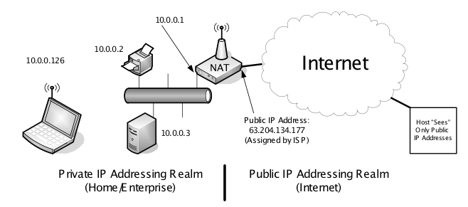
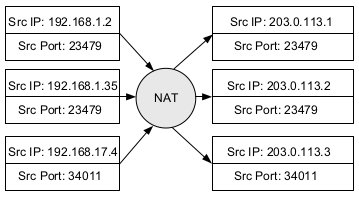
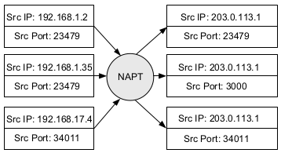
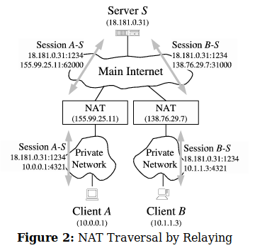

# Network Address Translation (NAT)

Apuntes para una clase de NAT. Referencias tomadas de:

[STE,1994] Stevens, W. Richard. *TCP/IP illustrated vol. I: the protocols*. Pearson Education India, 1994.

## Introducción

Con la masiva adopción de internet por áreas no relacionadas con la academia, como uso comercial y hogareño de los servicios prestados a través de esta red global, comienzan a vislumbrarse problemas en la cantidad de bloques de direcciones disponibles.

Si bien la cantidad de IPs teóricas posibles es $2^{32} = 4.294.967.296$ (4 billones), debido al uso de bloques reservados (Multicast, privados, etc...) las IPs públicas realmente disponibles rondan los 3 billones aproximadamente.

Ademas, en un momento inicial de Internet, al no saber realmente el despliegue masivo que tendría posteriormente, grandes bloques fueron asignados a organizaciones (bloques  /8 por ejemplo) lo que generó una sub-utilización de los bloques de direcciones.

En algún momento, se pensó en la posibilidad de que un mecanismo permita que muchos dispositivos compartieran una IP a los fines de rutear paquetes al exterior de una red, pero internamente puedan usar IPs diferentes. Si esto fuera posible, en distintas redes se podrían repetir IPs, siempre y cuando la utilizada para salir al exterior sea única en todo Internet. Otra restricción es que al interior de la red en cuestión, tampoco debe repetirse una IP.

Si esto se podía lograr, entonces los bloques de IP privados podían ser utilizados al interior de las organizaciones y la misma solo necesita una IP pública que, utilizando el mecanismo en cuestión, se use la IP pública entre todos los dispositivos.

Este, mas o menos, es lo que permite realizar el mecanismo de NAT.

## Definiciones

NAT permite que bloques de direcciones IP puedan ser re-usada en diferentes partes de la Red. La principal motivación de NAT fue la disminución y limites del espacio de direcciones IPv4.

El escenario de uso mas común es tener una única conexión a Internet (y una única dirección IP Pública asignada) pero un conjunto de dispositivos que requieren conectarse a la Red. En este escenario, un dispositivo se asigna para que todo el trafico saliente pase a través de el, y dicho dispositivo realice NAT. Típicamente este servicio es prestado por routers.

NAT es un mecanismo "parche" hasta que se termine de adoptar el protocolo que va a resolver el problema de fondo (cantidad de direcciones publicas ruteables) IPv6.

Por la naturaleza de su funcionamiento, donde todos los dispositivos deben rutear el trafico a través del router que realiza NAT, este mecanismo suele ir asociado a software de tipo Firewall, y es de hecho muy común que estos programas implementen los comandos para configurar NAT.

Existen algunas desventajas o inconvenientes de implementar NAT:

* Ofrecer servicios desde la red donde se hace NAT suele implicar algunas configuraciones adicionales.
* NAT debe modificar cabeceras de protocolos en varias capas para funcionar.
* Lo anterior implica que para una misma conexión, TODOS los paquetes deben pasar por el mismo dispositivo NAT, que es quien guarda la información del cambio en las cabeceras de cada paquete.
* Protocolos que envían información de direccionamiento IP en capa de aplicación (p.e. FTP o SIP) pueden tener inconvenientes en una conexión que utiliza NAT.

## Como funciona NAT

NAT consiste en reescribir la información de identificación del paquete que transita a través del router. En su forma básica, NAT re-escribe la dirección de IP origen del paquete que pasa a través del dispositivo hacia Internet, y la IP de destino al paquete que viene de ingreso a la red.

En el primer caso, la IP que se escribe en el campo de IP origen es la IP pública que tiene el dispositivo en su interfaz. En forma inversa, la IP destino que reescribe en lo paquetes que ingresen es la IP del dispositivo final al que se dirige el paquete.



### NAT Básico

El funcionamiento conocido como básico reescribe unicamente los campos de IP con un conjunto de IPs Publicas. Esto no es muy utilizado dado que no ayudaba a reducir el uso de IPs públicas.



### IP Masquerading (NAPT)

Uno de los usos mas extendidos de NAT, NAPT (Network Address Port Translation), define que el dispositivo que realiza NAT modifique la IP por una única IP pública, pero ademas modifique los puertos de Capa 4 (TCP o UDP) para mantener el mapeo hacia los dispositivos internos de la red.



En todos los casos, el objetivo es mantener la correspondencia entre los dispositivos dentro de la red para poder identificar en cada caso los paquetes que vengan desde el exterior puedan ser debidamente re-escritos y enviados a quien corresponda.

```bash
# Source NAT estatico, si cambia la IP pública la regla no aplica
iptables -t nat -A POSTROUTING -s 192.168.0.0/24 -o eth0 -j SNAT --to 203.0.113.1 
# Masquerade es un SNAT contempla que la IP pública puede ser dinamica
iptables -t nat -A POSTROUTING -s 192.168.0.0/24 -o eth0 -j MASQUERADE
```

### Port Forwarding

Un problema típico cuando se esta detrás de un dispositivo NAT es que sucede si algún equipo en la red interna desea prestar un servicio accesible desde el exterior. Se podrá instalar un servidor y que el mismo se encuentre disponible para recibir peticiones, pero debido a la restricción de NAT, ningún dispositivo del exterior podrá conseguir que algún paquete llegue al mismo de forma activa (es decir, comenzando la conexión). Decimos por ello que los equipos detrás de NAT no son directamente alcanzables desde el exterior.

Incluso permitiendo que el dispositivo NAT permita el ingreso de paquetes con segmentos que contengan el flag *SYN* activo, como lo habitual es que los dispositivos tengan IPs privadas, ningún dispositivo podrá llegar debido a que estos bloques de direcciones  no son ruteables en Internet.

La solución a este problema es **port mapping** o **port forwarding**. Este tipo de NAT consiste en lo siguiente:

"En el dispositivo que realiza NAT, se genera una regla que indique que cualquier paquete recibido a la IP pública del dispositivo y a un puerto definido de forma fija, sea ruteado a una IP / puerto especifico de la red interna."

Con dicha regla, todo el trafico entrante es reenviado a un *endpoint* o proceso en un dispositivo dentro de la red. Decimos que la configuración de dicha regla es "estática". Esto significa que un usuario con privilegios de administración de red debe tener acceso al dispositivo y realizar el ajuste de estos parámetros.

```bash
iptables -A PREROUTING -t nat -i eth0 -p tcp --dport 80 -j DNAT --to 192.168.1.2:8080
iptables -A FORWARD -p tcp -d 192.168.1.2 --dport 8080 -j ACCEPT
```

### Consideraciones

**1. Bloques de direcciones internos:** En principio no existen restricciones para que en la red interna detrás del NAT se utilice cualquier bloque de IPs, aun públicas (incluso no siendo de nuestra propiedad). El inconveniente de hacer esto es que si en algún momento, el dueño verdadero de ese bloque pone servicios en Internet, nuestra red interna no podrá llegar (porque las reglas de ruteo interno no saldrán hacia el exterior). Por eso lo recomendable y habitual es que detrás de un dispositivo que hace NAT se utilicen diferentes bloques de red del rango de direcciones privadas.

**2. Ocultación de la red:** Una de las ventajas de NAT, es que no manera, con lo visto hasta acá, de que algún dispositivo del exterior pueda conocer absolutamente nada sobre la topología interna de la red. Desde el exterior es imposible distinguir si una conexión es iniciada por un dispositivo a través de NAT o el paquete viene desde el origen directamente. Esto es a veces visto como una ventaja adicional de este mecanismo.

**3. NAT y TCP:** ¿Que efecto tiene todo el mecanismo de NAT en las conexiones TCP? En definitiva, si un socket es un par de identificadores de procesos en dispositivos finales, NAT cambia parte de esos identificadores, o en algunos casos, lo cambia completamente. Cuando se inicia una conexión, NAT detecta el segmento de apertura de conexión (vía cabecera *syn*). El dispositivo mantiene una tabla de mapeo de conexiones. Es necesario para cuando el servidor responda, que lo hará a la IP pública y puerto asignado por el dispositivo NAT. A este mecanismo se lo conoce como *port preservation*. Ademas NAT implementa timers y controles para verificar si la sesión TCP sigue activa en caso de inactividad.

**4. NAT y apps P2P:** En general y por su esquema, NAT esta configurado para descartar segmentos entrantes con el flag SYN activado (aplica a datagramas UDP sin correlación en la tabla de mapeo de NAT). Esto genera problemas con protocolos P2P (SIP, Bittorrent), donde las aplicaciones de usuarios detrás de NAT funcionan simultáneamente como clientes o servidores y ambos dispositivos se encuentran detrás de NAT. En este escenario, ningún dispositivo tiene una IP Pública a la cual "conectarse". Diferentes enfoques son utilizados para atender esta problemática.

**4.1. Relaying (retransmisión):** Consiste en no hacer un intento de conexión directa, sino utilizar un Servidor público y de confianza que retransmita todo el trafico entre ambos clientes.



Otra técnica es **hole punching**, donde a través de un servidor de confianza ambos clientes conocen las credenciales del otro, y ambos intentan iniciar una conexión. Esto implica, entre otras cosas, que NAT registre temporalmente la llegada de un segmento o datagrama entrante a la espera de uno similar desde la red interna, y en dicho caso (limitado temporalmente), la sesión es establecida.

**5. Cabeceras afectadas:** Como se pudo observar, implementar NAT requiere modificar diversos campos en varias capas de la pila de protocolos TCP/IP. Cuando un datagrama sale desde el interior de la red, son modificados los campos IP origen y tal vez el puerto de capa 4, pero ademas, debe modificarse el checksum de capa 3 y el mismo campo de capa 4 (en este ultimo caso, debe hacerse aun si no hubiera cambio de puerto, dado que el checksum de TCP involucra campos de IP - direcciones origen y destino, campo protocol number y campo total lenght).