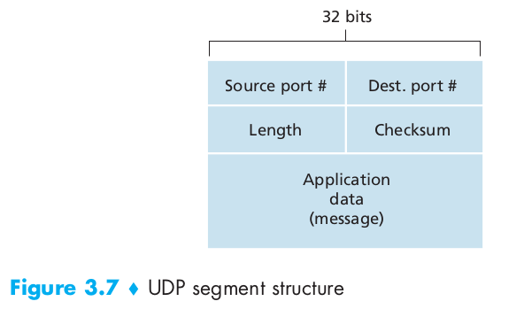
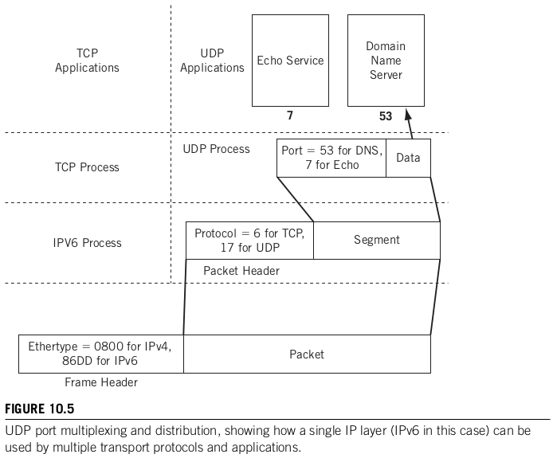

# UDP

Protocolo de capa de transporte no orientado a la conexión, no fiable, sin control de errores ni flujo. Por tal motivo, también es ligero y sencillo. Mensajes UDP pueden no llegar a destino o incluso llegar desordenados.

## Introducción

UDP (User Datagram Protocol) es un protocolo sencillo de capa de transporte, que se limita a unas pocas funciones en comparación al otro protocolo de la misma capa mas conocido, TCP.

Definido por J Postel en el RFC 768 (1980), con una actualizacion en el RFC 1122 (1989), la principal función que cumple UDP es la de multiplexar los datos que llegan a un dispositivo al servicio correspondiente en capa de aplicación. Idéntica función cumple el protocolo con los datos que genera capa 5 y solicitan servicios a UDP. Para lograr cumplir con esta tarea, se vale de un esquema similar al de TCP: Puertos. Estos puertos permiten realizar la multiplexación de servicios.

## ¿Porque UDP si existe TCP?

¿Porque elegir UDP teniendo TCP, el cual es confiable y asegura entrega ordenada?

* Control fino de cuando los datos son enviados: TCP implementa diversos mecanismos de control de congestión, que generan potenciales retrasos en el envío efectivo de los datos. UDP, por el contrario, recibe datos de la capa de aplicación, agrega un grupo muy pequeño de cabeceras, y pasa los datos a capa de red. La injerencia de UDP en el tiempo de comunicación es muy baja. Existen aplicaciones de diversos tipo que pueden requerir esto, por ejemplo, apps en tiempo real.
* Evitar el establecimiento de la conexión: En TCP, el 3wh es un procedimiento previo a el envío de cualquier bit de datos. Esto genera un delay importante en el comienzo del envío de los datos. UDP no tiene este paso, y cuando recibe los bytes a enviar, estos se envían directamente.
* No hay mantenimiento de estado: Un conjunto de datos en memoria son requeridos para mantener el estado de la conexión. Buffers de entrada / salida, parámetros para control de congestión y números de secuencia. UDP no tiene necesidad de almacenar ningún dato como este o parecido.
* Overhead: Mientras que el header de TCP es de 20 bytes, el de UDP es de 8.

## PDU de UDP

* Puerto origen (2 bytes): optativo, es el puerto al que eventualmente debería darse una respuesta (si hubiera). En caso de no ser necesario, puede estar en cero.
* Puerto destino (2 bytes): que indica el servicio al que se quiere acceder.
* Length o tamaño (2 bytes): Tamaño total de la PDU. El valor mínimo es 8 (el header y sin datos).
* Checksum (2 bytes): computa la integridad del pseudo header ip (ip origen y destino, protocolo y tamaño), el header UDP y los datos.

## Discusiones

Es posible construir un servicio confiables usando UDP como capa de transporte. ¿Como? Implementando mecanismos necesarios (control de flujo, congestión, errores) en capa de aplicación.

Existen consideraciones sobre usar UDP para flujos de datos grandes (Caso multimedia). Al no tener mecanismos de control de congestión, puede generar una saturación en la red.

En el campo "Protocolo" de IP, UDP es designado con el numero 17.

El conjunto de puertos de NAT es independiente de los puertos de TCP. Esto es, si existe un web server ocupando el puerto TCP/80 como único servicio de un host, el puerto 80 UDP esta libre. 

## Ejemplos

Ejemplos de Aplicaciones que utilizan UDP como capa de transporte

DNS en el puerto UDP 53.

RIP usa UDP para cumplir sus funciones.

SNMP.

NFS.

Streaming / Telefonia no Web.