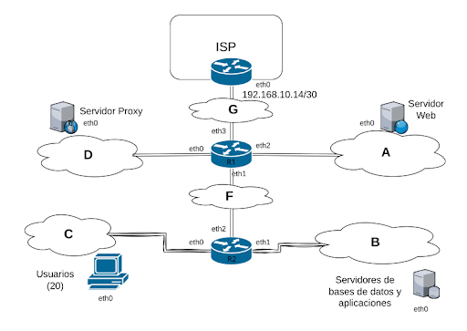

TP - Ruteo estático y Traducción de Direcciones de Red en Kathara
===========================

**Fecha de Entrega Comisión 6 (Luján): 04/06/2026 - Comisión 35 (Chivilcoy): 05/06/2026**

**URL de Entrega:** <https://tinyurl.com/TyR-2026-TPx>

**Objetivos:** 

- Comprender el direccionamiento IPv4 y subnetting mediante la asignación de direcciones en una topología dada.

- Analizar el ruteo estático definiendo rutas explícitas en cada nodo e interpretando el recorrido de los paquetes.

- Entender el mecanismo NAT y su impacto en el flujo de tráfico.

#### Escenario

Suponga que la red cuya topología se muestra en la siguiente figura corresponde a una organización para la que usted debe asignar direcciones y configurar los dispositivos. Usted deberá implementar un laboratorio en Kathara que refleje dicha configuración. 

Además se requiere que su implementación respete las siguientes consignas:

1. Bloque de direcciones asignado para la organización: `170.210.96.0/28` 
2. Dirección IP asignada al router de borde del ISP:  `192.168.10.14/30` 
3. Los servidores web y el servidor de correo prestan servicio hacia el exterior (Internet) 
4. Los servidores de aplicaciones y bases de datos son accedidos solamente por los usuarios corporativos (Red C). 
5. Los usuarios pueden navegar por Internet solamente a través del servidor proxy, y pueden acceder al correo electrónico y la web corporativa de forma directa (sin proxy).

{width=75%}

### Actividad 1. Ruteo

#### Consignas

 1. Implemente su solución en kathara utilizando como base los archivos disponibles en <https://github.com/redesunlu/kathara-labs/blob/main/tarballs/kathara-lab_ruteo_nat.tar.gz>. 
 2. Complete los archivos de extensión *.startup* que se encuentran en el laboratorio de manera tal que al ejecutarlo se inicie con la configuración necesaria para probar conectividad entre los diferentes hosts.
 3. En base a su configuración complete una tabla con la siguiente información de todos los dispositivos en la red:
                
                | Hostname | IP | Interface | MAC |
                |----------|----|-----------|-----|
                |          |    |           |     |

 4. Diseñe y detalle un procedimiento que le permita verificar si la configuración propuesta por usted es funcional y, además, cumple con los requerimientos planteados como consigna.
 5. Ejecute un *ping* (utilice el parámetro `-c1`) desde el host del usuario hacia el proxy. Capture los mensajes intercambiados y luego complete la siguiente tabla con la información presente en cada uno de ellos: 
    
                | IP Origen | MAC Origen | IP Destino | MAC Destino |
                |-----------|------------|------------|-------------|
                |           |            |            |             |

### Actividad 2. Traducción de Direcciones de Red (NAT)

#### Consignas

 1. En el router **r2** ejecute el siguiente comando, reemplazando la variable *$RED_USUARIOS* por la dirección de red que usted asignó a los usuarios (red C):

     `iptables  -t nat -A POSTROUTING -s $RED_USUARIOS -o eth2 -j MASQUERADE`  

    Luego:
    - Investigue y explique, con sus propias palabras, cuál es la función del comando anterior.
    - Describa qué efecto produce sobre los paquetes que salen del router.

 2. Repita el punto 5 de la sección anterior. A continuación:

    - Compare los resultados obtenidos antes y después de aplicar la regla anterior y describa las diferencias observadas entre ambas tablas.
    - Explique, con sus propias palabras, qué acciones realiza ahora el router **r2** sobre el tráfico proveniente de la red de usuarios.
    - Con NAT activo en **r2**, ¿qué red destino puede eliminar **r1** de su tabla de ruteo sin afectar la conectividad? Explique. 

