Clase Teórica sobre Ruteo Estático y Dinámico
=============================================

Algunas notas varias

- Clase 1 Jue 23/May --> Ruteo estático y 1ra parte de dinámico
- Clase 2 Jue 30/May --> 2da parte ruteo dinámico y práctica
- Bibliografía: Peterson. Kurose.
- [Slides originales (PDF) de Gabriel](http://www.tyr.unlu.edu.ar/pub/11-Red.pdf)
- [Slides nuevas en Drive](https://drive.google.com/drive/folders/1kSItBJif2za2kNWXoTAlTo8yGi67kh5P)
- Armar topologia de 3 routers, un par de hosts en cada red, y uno con salida a internet. Queda como apunte y no va a slides.

Temario

- Definición de Encaminamiento
    - La red como un grafo
        - Nodos: Dispositivos (finales e intermedios)
        - Aristas: Enlaces de red
    - Recordar conmutación de paquetes y la decisión de por dónde se (re)enviará un paquete.
        - En circuitos virtuales solo es un problema en la fase de establecimiento de la conexión
        - En una red de datagramas, no existe un camino, sino que la decisión del próximo salto se va tomando en cada nodo intermedio, para cada datagrama.
    - Partir de una red de capa 2 (LAN), consultar si es posible cursar paquetes allí; extender a dos redes interconectadas. Cómo es posible cursar un paquete de una a otra y viceversa?
    - Richard Martin discrimina Ruteo vs Reenvío. _Rutear_ es tomar la decisión de por donde (re)enviar un paquete. _Reenviar_ es la acción siguiente: (re)inyectarlo en el medio. Kurose plantea la misma diferencia, y ademas dice que son las 2 funciones principales de la capa.
    - Se trata entonces de ver como cada nodo intermedio dispone de TODA la información necesaria para tomar la mejor decisión posible sobre el próximo salto de cada datagrama.
        - Estructura: Tabla de rutas (como se llena dicha tabla?)
    - Objetivo: encontrar el camino mas corto entre 2 nodos
- Explicar tipo de entrega
    - Directa (misma red de capa 2)  
      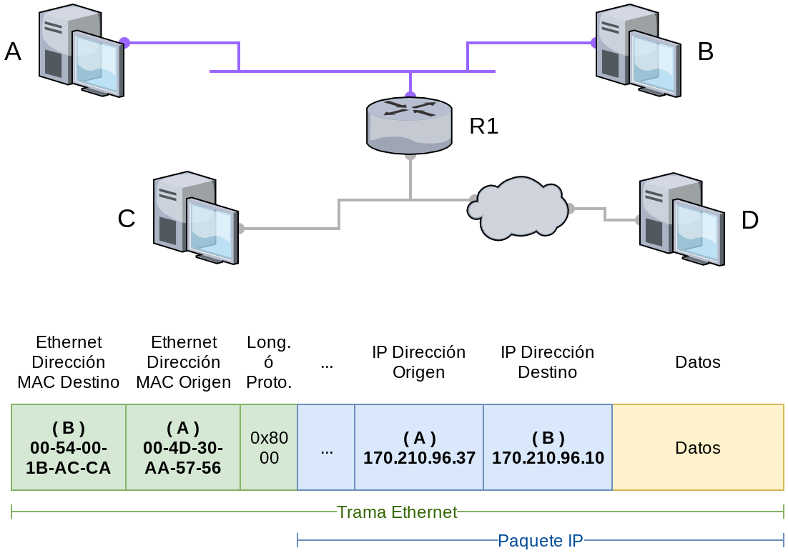
    - Indirecta (otra red de capa 2 anexa)  
      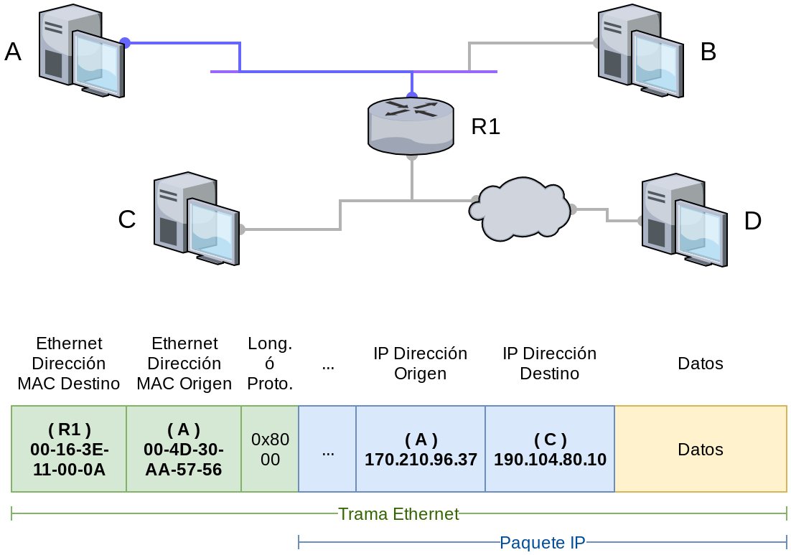
- Tabla de rutas
    - Explicar cada columna de `route` 
        - Red destino
        - Mascara
        - Gateway o salto siguiente
        - Interfaz
        - Métrica (opcional): Costo, distancia, latencia.
    - Explicar cómo se selecciona / busca la ruta elegida
        - Para cada fila de la tabla de rutas
        - Se hace DIR_DESTINO AND MASCARA-FILA
        - Se compara contra DIR_RED de la FILA
        - Si son iguales, enviar por la interfaz de la fila (al destino o a GW)
        - Si son distintas, seguir revisando
        - Eventualmente podría coincidir con varias entradas. En tal caso gana la que "mas coincide", pero no hablaremos de de Longest-Prefix-Match.
    - Explicar qué es _gateway_
    - Qué pasa si uno quiere enviar un paquete a direcciones desconocidas? (pie para default gw)
    - Explicar qué es un _default gateway_
- Cómo se llena una tabla de rutas?
    - Manualmente mediante `ip address add` e `ip route add`
        - Ver tema rutas directas (addr add) e indirectas (route add)
        - Problema: Cambios en la topología
          - Enlaces se caen
          - Nuevos nodos
          - Costos de enlace cambian
    - Dinámicamente (protocolos de ruteo dinámico)
    - Mensajes ICMP Redirect

Hasta aquí debería llevar aproximadamente 1 hora.

- Dibujar topología estilo parcial en el pizarrón y realizar ejercicio en clase (ejemplo charlado con Gabriel).

    1. Poner nombre a las interfaces de cada host y routers
    2. Asignar direcciones de las redes en cada enlace
    3. Asignar direcciones IP a cada interfaz en cada host y router
    4. Definir tablas de rutas necesarias para comunicar B --> A
    5. Definir tablas de rutas necesarias para comunicar B --> C
    6. Definir tablas de rutas necesarias (default) para que D llegue a Internet
    7. Preguntar cambios necesarios para comunicar D --> B (ruta específica)

    Observaciones:

    - No mencionar Default Gateway hasta el punto 6.
    - Todo lo que esté en la columna Gateway debe ser vecino (toda IP debe ser directa)
    - Tanto B como C no necesitan conocer redes intermedias para pasar a través de ellas
    - Las redes de interconexión (R1 -- R3) pueden ser privadas

- Hacer previo a la clase, la tabla de rutas que sería "ideal".

    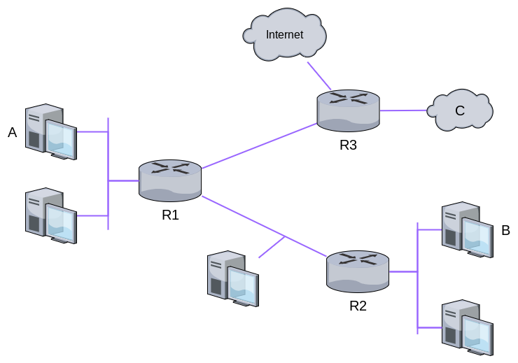

Esto nos debería tomar 1 hora más.
Y el resto, lo que se pueda, para lo que sigue.

- Antes de Ruteo Dyn hablar de Sistemas Autónomos.
    - Comentar a muy alto nivel la arquitectura de Internet
    - Comentar la administración de las tablas de rutas a gran/mediana escala
    - Diferenciar ruteo interno (vistos) vs ruteo externo (BGP / IS-IS)
      - IGP (Nodos bajo un mismo control administrativo)
      - EGP (Redes de diferentes "dueños")
- Preguntar qué sucede si la cantidad de redes de capa 3 se incrementa --> ir llevándolos a la necesidad de Ruteo Dyn.
- Caracteristicas
    - Dinámicos: Las novedades en la topología son informadas cuando suceden y la red se ajusta en respuesta
    - Distribuidos: Todos los ruteadores de la red reciben las novedades, no hay un nodo que centralice la información
    - Metodo para distribuir las novedades.
    - Metodo para calcular el camino mas corto.
- Algoritmos de ruteo o de _mantenimiento de tablas_
    - Distance-Vector / Bellman-Ford
      - Hay ejemplo en peterson de una [topologia sencilla](#ejemplos-de-topología).
      - Me gusto mucho esta imagen para explicar Vector de Distancia. NO VA A LA CLASE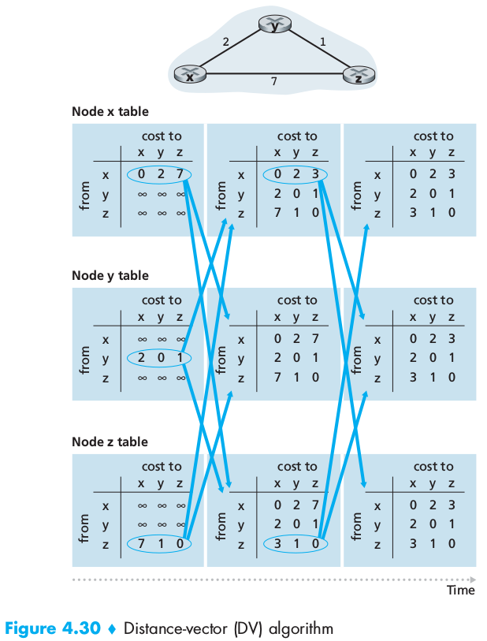
      - Cuenta al infinito. Escenario con topologia de Peterson.
        - Se cae enlace entre A y E. A actualiza su costo a E a infinito.
        - B y C anuncian que tienen costo 2 para llegar a E.
        - B entonces descarta A (infinito) pero C anuncia costo 2, y por lo tanto puede llegar con costo 3 por C. Anuncia esto a A y B.
        - A concluye que puede alcanzar a E con costo 4 por B. Anuncia a C.
        - C concluye que puede alcanzar E a costo 5 por A. Y asi.
      - Cuenta al infinito: soluciones
        - Reducir el numero que signifique infinito (p.e. 16). Impone una longitud máxima de la red
        - *Split Horizont*. Consiste en no anunciar las rutas a los nodos de los cuales fueron aprendidas.
        - *Split Horizont with poison reverse*: Variante de mayor fortaleza, donde en lugar de no anunciar una ruta al nodo del cual la aprendimos, se le envía la misma con información negativa, por ejemplo infinito.
        - Esto solo evitaba los problemas en loops pequeños (2 nodos). En redes mas grandes había que implementar técnicas mas complejas que hacían que los tiempos de convergencias sean bastantes altos.
    - Link-State / Dijkstra
      - Ejemplo de topologia y Shortest Path en Peterson
    - Luego de los ejemplos, esta bueno recapitular:
      - Convergencia: Proceso mediante el cual la información de ruteo queda consistente en todos los nodos de la topología.
      - Ningún nodo conoce el estado **global**, solo su tabla de rutas.
      - Cuando un nodo decide enviar actualizaciones a vecinos.
        - Con cierta frecuencia fija (típicamente segundos), aunque no haya cambios (ayuda a saber que el nodo esta activo)
        - Disparado por una novedad en algún vecino.
- Explicar ambos con ejemplos
- Bajar a realidad _comentando_ las implementaciones de ambos
    - RIP
      - Protocolo que implementa un algoritmo de ruteo basado en vector de distancias
      - Es un protocolo muy sencillo. Su PDU es muy sencilla. (Ejemplo abajo)
      - Actualizaciones cada 30 seg.
      - Los enlaces tienen costo 1. (costo es la cantidad de saltos)
    - OSPF
      - Implementa estado del enlace (Dijkstra)
      - Inicialmente todos los nodos comparten sus enlaces directos con todo el resto de la red
      - Esto es condición suficiente que el resto de los nodos conozcan todo el estado de la red (a diferencia de vector distancia) y pueda aplicar el algoritmo de camino mas corto
      - 2 mecanismos: Diseminación confiable de los estados-enlace y calculo del camino mas corto
      - Diseminación via *flooding*.
    - Explicar pero no ahondar demasiado en ellos
    - Métricas
      - 1 por link. Entonces, el costo indica la cantidad de saltos.
        - 1 enlace satelital con alta latencia vale igual que 1 enlace de fibra
        - Tampoco por capacidad del canal
      - Tamaño de la cola de paquetes
      - Combinación de latencia y ancho de banda y tipo de enlace.

## Ejemplos de Topología

### Peterson: Vector Distancia

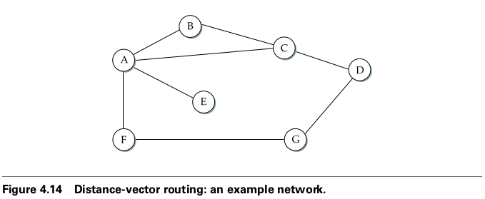

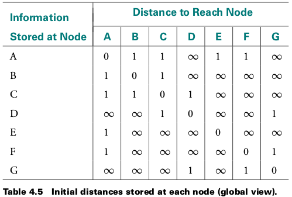

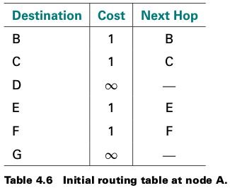

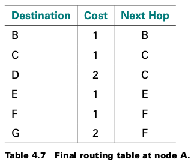

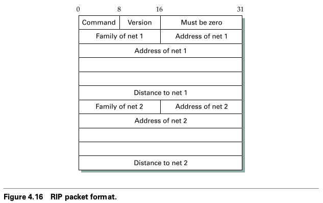

Explicación del algoritmo de ruteo vector distancia con la topología de la figura 4.14.

#### Introducción

Dada la topología de la figura 4.14

1) Plantear la tabla de rutas del Router A (RA) en el estado inicial.

2) RA recibe un anuncio de la tabla inicial del RC. En base a dicha información actualizar la tabla de RA.

3) RA recibe anuncio de tabla inicial de RF. Actualizar la tabla de RA con dicha información.

Nota: En este ejemplo de Peterson, todos los enlaces tienen costo 1 por dos motivos. En primer lugar, es más sencillo de explicar, y en segundo lugar, en el protocolo RIP todos los enlaces tienen por defecto costo 1 (la PDU tiene un campo para indicar un costo != 1, pero parece que no es lo habitual). El único inconveniente que se me ocurre para este tipo de ejemplos sencillos es que no refleja cambios en las tablas de ruta que puedan suceder por la incorporación de rutas más "económicas". Es decir, todos los cambios de rutas que sucedan se darán por incorporación de nuevos destinos o por cambios de topología explícitos (caída de enlace/router).

#### Paso 1: Tabla inicial de Router A 

| Destino | Costo | Salto |
| ------- | ----- | ----- |
| A       | 0     | -     |
| B       | 1     | B     |
| C       | 1     | C     |
| D       | inf   | -     |
| E       | 1     | E     |
| F       | 1     | F     |
| G       | inf   | -     |

#### Paso 2: Recepcion del vector de distancias de Router C:

| Destino | Costo |
| ------- | ----- |
| A       | 1     |
| B       | 1     |
| C       | 0     |
| D       | 1     |
| E       | inf   |
| F       | inf   |
| G       | inf   |

#### Paso 3: Calcular la tabla temporal en base a vector de RC

Seria la tabla de rutas si siempre se debiera pasar por RC. Es el costo entre RA y RC mas los costos de RC:

| Destino | Costo |
| ------- | ----- |
| A       | 2     |
| B       | 2     |
| C       | 1     |
| D       | 2     |
| E       | inf   |
| F       | inf   |
| G       | inf   |

#### Paso 4: Calcula nueva tabla de A

Para cada destino, es el menor valor entre Tabla inicial y Tabla temporal. En los casos que el menor sea de la temporal, el siguiente salto es C. (aprende RD)

| Destino | Costo | Salto |
| ------- | ----- | ----- |
| A       | 0     | -     |
| B       | 1     | B     |
| C       | 1     | C     |
| **D**   | **2** | **C** |
| E       | 1     | E     |
| F       | 1     | F     |
| G       | inf   | -     |

#### Paso 5: Recepción del vector distancia de RF

| Destino | Costo |
| ------- | ----- |
| A       | 1     |
| B       | inf   |
| C       | inf   |
| D       | inf   |
| E       | inf   |
| F       | 0     |
| G       | 1     |

#### Paso 6: Tabla Temporal en RA en base a vector de RF

De nuevo, es el costo de llegar a cada destino, sumándole al vector de RF el costo entre RA y RF.

| Destino | Costo |
| ------- | ----- |
| A       | 2     |
| B       | inf   |
| C       | inf   |
| D       | inf   |
| E       | inf   |
| F       | 1     |
| G       | 2     |

#### Paso 7: Nueva tabla de A 

(aprende G)

| Destino | Costo | Salto |
| ------- | ----- | ----- |
| A       | 0     | -     |
| B       | 1     | B     |
| C       | 1     | C     |
| D       | 2     | C     |
| E       | 1     | E     |
| F       | 1     | F     |
| **G**   | **2** | **F** |

Esta es la tabla final del ejercicio.

#### Resolución alternativa

[Tabla inicial de A](#tabla_a_inicial)

##### Tabla temporal de A para cálculo luego de recibir info de C

| Destino | Costo Actual (Ca) | Salto Actual | Mensaje C | Costo x C (Cc) | Min(Ca, Cc) | Salto |
| ------- | ----------------- | ------------ | --------- | -------------- | ----------- | ----- |
| A       | 0                 | -            | 1         | 1 +1           | 0           | -     |
| B       | 1                 | B            | 1         | 1 +1           | 1           | B     |
| C       | 1                 | C            | 0         | 0 +1           | 1           | C     |
| D       | inf               | -            | 1         | 1 +1           | **2**       | **C** |
| E       | 1                 | E            | inf       | inf            | 1           | E     |
| F       | 1                 | F            | inf       | inf            | 1           | F     |
| G       | inf               | -            | inf       | inf            | inf         | -     |

##### Tabla temporal de A para cálculo luego de recibir info de F

| Destino | Costo Actual (Ca) | Salto Actual | Mensaje F | Costo x F (Cf) | Min(Ca, Cf) | Salto |
| ------- | ----------------- | ------------ | --------- | -------------- | ----------- | ----- |
| A       | 0                 | -            | 1         | 1 +1           | 0           | -     |
| B       | 1                 | B            | inf       | inf            | 1           | B     |
| C       | 1                 | C            | inf       | inf            | 1           | C     |
| D       | **2**             | **C**        | inf       | inf            | 2           | C     |
| E       | 1                 | E            | inf       | inf            | 1           | E     |
| F       | 1                 | F            | 0         | 0 +1           | 1           | F     |
| G       | inf               | -            | 1         | 1 +1           | **2**       | **F** |

[Tabla final de A](#tabla_a_final)

### Peterson: Djikstra

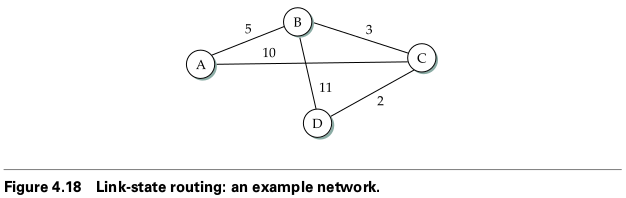

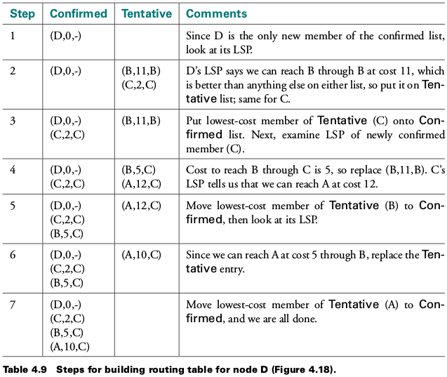

### Topología de Gabriel

La topología a continuación se viene usando en las clases de TyR hace años:

#### Vector Distancia

Objetivo: Obtener la tabla de A luego de realizar un intercambio con B y luego con C.  
Se indican con negrita las rutas que se actualizan.

##### Intercambio con B

| Destino | Costo Actual (Ca) | Salto Actual | Vector de dist. de B | Costo x B (Cb) | Min(Ca, Cb) | Salto |
| ------- | ----------------- | ------------ | --------- | -------------- | ----------- | ----- |
| A       | 0                 | -            | 5         | 5 + 5 = 10     | 0           | -     |
| B       | 5                 | B            | 0         | 0 + 5 = 5      | 5           | B     |
| C       | 2                 | C            | 4         | 4 + 5 = 9      | 2           | C     |
| D       | 3                 | D            | inf       | inf + 5 = inf  | 3           | D     |
| E       | inf               | -            | 3         | 3 + 5 = 8      | **8**       | **B** |

##### Intercambio con C

| Destino | Costo Actual (Ca) | Salto Actual | Mensaje C | Costo x C (Cc) | Min(Ca, Cc) | Salto |
| ------- | ----------------- | ------------ | --------- | -------------- | ----------- | ----- |
| A       | 0                 | -            | 2         | 2 + 2 = 4      | 0           | -     |
| B       | 5                 | B            | 4         | 4 + 2 = 6      | 5           | B     |
| C       | 2                 | C            | 0         | 0 + 2 = 2      | 2           | C     |
| D       | 3                 | D            | inf       | inf + 2 = inf  | 3           | D     |
| E       | 8                 | B            | 4         | 4 + 2 = 6      | **6**       | **C** |

##### Tabla final del ejercicio para A

| Destino | Costo | Salto |
| ------- | ----- | ----- |
| A       | 0     | -     |
| B       | 5     | B     |
| C       | 2     | C     |
| D       | 3     | D     |
| E       | 6     | C     |

#### Estado del Enlace

| Paso | Confirmados                   | Tentativo             | Grafo                 |
| ---- | ----------------------------- | --------------------- | --------------------- |
| 1    | Ø                             | **(A,0)**             | Ir dibujando el grafo |
| 2    | (A,0)                         | (B,5) **(C,2)** (D,3) |                       |
| 3    | (A,0) (C,2)                   | (B,5) **(D,3)** (E,6) |                       |
| 4    | (A,0) (C,2) (D,3)             | **(B,5)** (E,6)       |                       |
| 5    | (A,0) (C,2) (D,3) (B,5)       | **(E,6)**             |                       |
| 6    | (A,0) (C,2) (D,3) (B,5) (E,6) | Ø                     |                       |

Se indican con negrita los nodos elegidos (por menor coste) en cada iteración.

Tabla final:

| Destino | Costo | Salto |
| ------- | ----- | ----- |
| A       | 0     | -     |
| B       | 5     | B     |
| C       | 2     | C     |
| D       | 3     | D     |
| E       | 6     | C     |

