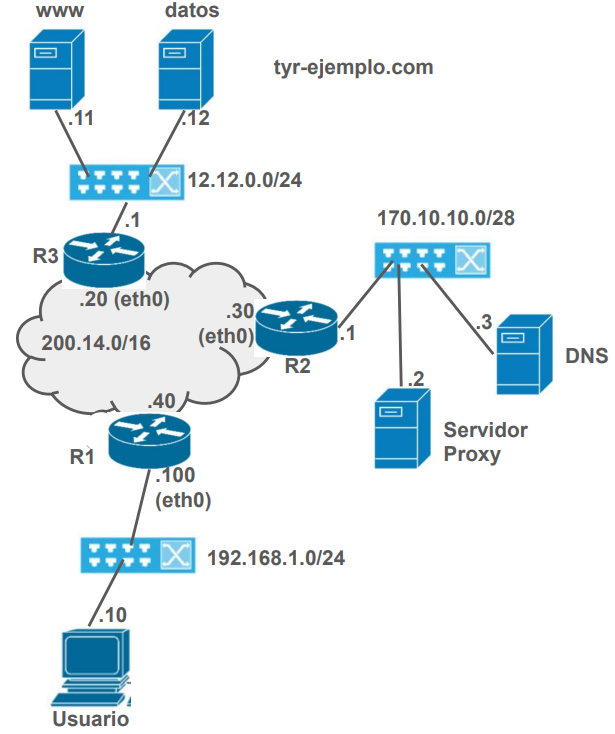

Trabajo Práctico Final Integrador: Configuración de Redes y Análisis de protocolos
===========================

**Objetivo:** Este trabajo práctico final tiene como objetivo principal la integración de los contenidos teóricos de la asignatura con las habilidades adquiridas durante las clases de laboratorio, aplicándolos a un caso de estudio real que puede ocurrir en su vida profesional. Se plantea una topología de red a implementar en un laboratorio de simulación, un conjunto de restricciones funcionales y una serie de consignas a resolver.

La actividad propuesta se divide en dos partes: en la primera, deberán configurar dispositivos y servicios de acuerdo a las especificaciones. Esta tarea se realiza sobre la base de un laboratorio de Kathara (similar a los utilizados en las actividades prácticas). Los docentes participan solamente de la resolución de problemas ajenos al TP y/o despejar dudas. La segunda parte corresponde a la generación de tráfico, captura y posterior análisis de los mensajes intercambiados entre los protocolos involucrados.

**La entrega y aprobación de este Trabajo Práctico es condición necesaria (pero no suficiente) para aprobar la asignatura (promocionar o rendir el final). Esta actividad es de resolución personal.**

#### Actividades

#### Preparatoria

* Antes de la realización de este trabajo usted debe preparar sus propios datos para la prueba. Para ello, descargue la plantilla HTML\footnote{\url{http://www.tyr.unlu.edu.ar/pub/TP-Final-template.html}} y complétela con sus datos. Renombre el archivo \texttt{index.html} (todo en minúsculas).

* Recuerde que es estrictamente necesario contar con estos datos \textbf{ANTES} del día de la realización de este TP para evitar demoras durante la actividad (revise el cronograma).

#### En el laboratorio

1. Descargue el labo base\footnote{\url{https://raw.githubusercontent.com/redesunlu/kathara-labs/main/tarballs/kathara-lab_TP_Integrador-2024.tar.gz}} e implemente en el laboratorio de Kathara las redes de acuerdo al plano de topología de la Figura fig:topologia. 

2. Configure las interfaces, ruteadores/rutas, resolvers y NAT. El servidor DNS maneja la zona \texttt{tyr-ejemplo.com} (ya se encuetra configurado). Revise qué servicios debe iniciar y los puertos en los que operan los servidores web y el proxy. El equipo de usuario (Usuario) accede al exterior a través del servidor proxy (revise la configuración para reconocer cómo es en este caso). 

3. Copie la plantilla con sus datos al directorio público del servidor \texttt{datos.tyr-ejemplo.com}.

4. Luego, debe realizar la captura de tráfico de una transferencia completa de su página web usando el comando \texttt{w3c} (las instrucciones se encuentran dentro de los fuentes del laboratorio) y todo su contenido asociado, utilizando el mnemónico del servidor web. La captura debe comenzar con el equipo cliente \textit{apagado} (tablas ARP de ruteadores y hosts vacías), y finalizar cuando se recupera la página completa. La captura original (incluyendo carga de aplicación) debe ser enviada al equipo docente junto con el trabajo. 

#### En su casa

1. Descarte los mensajes que no pertenecen específicamente a esta transferencia. Ordene las PDUs por su marca de tiempo y numérelas (no use el número de secuencia asignado durante la captura). Agregue en su interface de Wireshark las direcciones de capa 2 para facilitar la identificación real de origen/destino de los mensajes.
2. Confeccione cuadros con la distribución de mensajes por protocolo por capa (Indique claramente qué protocolo/s ubica en cada capa y por qué).
3. Identifique todas las conexiones TCP. Por cada una, indique: finalidad, sockets de cliente y servidor, segmentos de apertura y cierre. Muestre los parámetros intercambiados durante la fase de apertura.
4. Para la conexión TCP utilizada para recuperar el archivo \texttt{.html} entre usuario y proxy indique la finalidad de cada PDU intercambiada a nivel de transporte y aplicación. 
5. Genere un diagrama de intercambios en el tiempo que muestre cómo sucedieron los mensajes, incluyendo TODOS los dispositivos involucrados. Por cada mensaje, identifique los principales parámetros que hacen a su función. En su gráfico, utilice diferentes colores para las diferentes conexiones (incluya las referencias correspondientes)\footnote{No use ningún software de generación automática del gráfico.}.
6. Compare los headers HTTP del requerimiento del cliente al proxy con respecto del realizado por el proxy al servidor web. Muestre y explique las diferencias.
7. Confeccione una tabla con los diferentes protocolos involucrados, cantidad de PDUs, total en headers y total en datos. De allí, calcule el \textit{overhead} ($Overhead = \frac{Total\_Datos\_Control}{Total\_Datos\_Tx}$) total y por protocolo generado para lograr la transferencia. Se sugiere armar una tabla en la cual cada fila $F_i$ corresponde a una PDU y cada columna a un protocolo $P_j$ (de diferentes capas). Luego, en cada celda $i, j$ consigne el tamaño en bytes que corresponde a esa $F_i$ y $P_j$. Genere una gráfica acorde para mostrar los resultados.

___
**NOTAS** 

1. El análisis debe corresponder a su interpretación de lo sucedido. No use interpretación que ofrece Wireshark ya que puede llevar a errores debido a cómo se realiza la captura.
2. Su reporte final debe estar formado por un mismo documento entregable (pdf). Puede anexar archivos auxiliares como la captura y una planilla con los cálculos (distribución de mensajes, overhead, etc.)
3. Incluya las respuestas a cada una de las consignas de manera explícita, clara y ordenada. 
___

 

