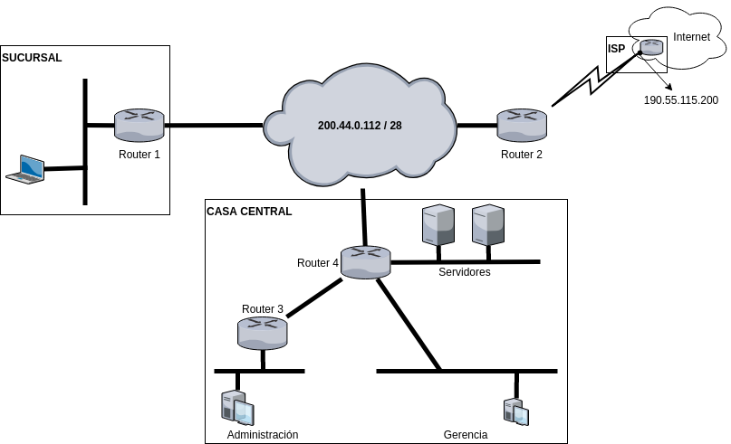

TP - Ruteo estático
===========================

**Fecha de Entrega:** 27/05/2020

**Objetivo:** Entender el funcionamiento de redes IP que basan sus estrategias de direccionamiento de paquetes a través del mecanismo de ruteo estático, mediante la configuración de un escenario hipotético.

La entrega de este TP se realiza mediante el siguiente formulario.

#### Escenario

Una organización posee una red que interconecta a su Casa Central con una sucursal y con un ISP que provee acceso a Internet (como se indica en la Figura 1) . Los routers son administrados por la misma organización y están comunicados entre sí a través de la red `200.44.0.112/28`.

La organización posee asignado todo el bloque de direcciones `200.14.32.0` con máscara `255.255.255.0`, que debe asignar para el resto de las redes según el criterio que usted considere adecuado. El ISP provee como punto de salida hacia Internet un router propio cuya interfaz tiene asignada la dirección IP `190.55.115.220`. La Figura 1 representa gráficamente la topología de la red de la organización.

Con esta información usted debe especificar la configuración que permita que la Casa Central se comunique con la Sucursal y permita comunicar completamente todas sus redes internas. Luego, se permita acceso a Internet a la Gerencia, los Servidores (los cuales prestan servicios al exterior) y a la Sucursal. La Administración no debe poder cursar paquetes hacia Internet.

#### Consignas

1. Poner nombre a las interfaces de cada host y routers.
2. Asignar direcciones de las redes en cada enlace.
3. Asignar las direcciones IP a las interfaces de todos los routers y de un host de cada red.
4. Definir las tablas de rutas de los ruteadores R1, R2, R3 y R4 para que respondan a los requisitos previamente mencionados.
5. Indicar cualquier otra configuración y/o suposición realizadas (o restricciones impuestas). Justificar.

{ width=75% }

#### Bibliografía

- Fall, K. R., & Stevens, W. R. (2011). TCP/IP illustrated, volume 1: The protocols. addison-Wesley. Capítulo 5.
- Kurose, J. F., & (2013). Computer networking: A top-down approach. Pearson. Capítulo 4.
- Peterson, Larry L. & Davie, Bruce S. Computer networks : a systems approach. 5th ed. 2012. Capítulo 3.