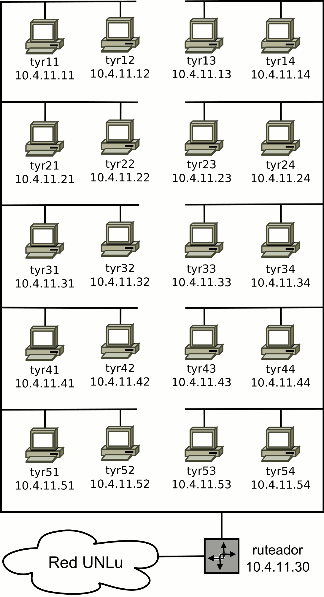

TPL 1 - Configuración inicial de la red del laboratorio
=======================================================

**Fecha de Entrega:** 29/08/2019

**Objetivo:** Conocer el procedimiento inicial y hacer habitual la práctica de configuración de un host en una red basada en el juego de protocolos TCP/IP.

#### Notas para ayudantes

* Por Florge 2019. Cambiado dmesg por ip link, . ¿Será necesario poner una salida de ip link show explicándola? tshark por tcpdump, y reordenado el punto de asignar nombre al host.
* Ojo con el filtro de tcpdump para el ping, porque si se hace ping a la propia IP publica (sea de localhost o de la interfaz física), el comando no captura nada. Si se hace ping a un host externo, el filtro funciona perfectamente. En wireshark pasa exactamente lo mismo. Hay confirmación del comportamiento en un [hilo de StackOverflow](https://unix.stackexchange.com/questions/491859/ping-uses-localhost-instead-of-public-ip-address) y en un [mensaje de lista de correo de 2008](https://groups.google.com/d/msg/comp.protocols.tcp-ip/TNkCcZWV3e4/RZ2LVPTsA98J). **La "solución" mas sencilla es hacer ping a otro host.**
Quizás la mejor explicación sea esta:

    > Physically, if it actually went out on eth0 it wouldn't be received, an Ethernet interface doesn't "hear" what it's sending. So in any case, there needs to be a shortcut somewhere that says "oh this is a local packet, it must be handled locally". Probably easier to redirect the packet to lo0 than adding a "handle outbound traffic as inbound path", though one would have to check the relevant RFCs for correctness. – [jcaron Jan 1 at 13:20](https://unix.stackexchange.com/questions/491859/ping-uses-localhost-instead-of-public-ip-address#comment902770_491859)

#### --- Fin notas para ayudantes ---

**Consignas**

Los comandos necesarios para llevar adelante la práctica se encuentran listados en el apunte respectivo de la asignatura, disponible en la web de la misma. En todos los casos, el informe a entregar debe mostrar los comandos ejecutados y las salidas obtenidas (en caso de ser una salida extensa, resaltar la parte importante). Ademas se debe explicar que se interpreta de dicha salida y si es lo esperado en cada caso.

1. Verificar la/s interfaces físicas de red (comúnmente llamada _placa de red_ o _NIC_) que el sistema operativo haya detectado. Para ello debe, primero activar las interfaces disponible, y luego listar su información en pantalla.

    ¿Que comando utilizó?
    ¿Cual es el nombre de las interfaces?
¿Que parte de la salida le indicó cual es la interfaz que se encuentra conectada?
    ¿Cual es el nombre de la interfaz física que se encuentra conectada al cable de red?

2. Configuración de interfaces de red para utilizar el protocolo TCP/IP. El paso siguiente es asignar a la interfaz física una dirección de red IP según el plano anexo.

3. Verificar que es posible contactar a otros 2 equipos de la red.

4. Cambie la configuración del nombre del equipo (temporal y permanente).

5. Resolución de nombres de hosts a direcciones IP.

    a. Configurar el dispositivo con los nombres y las direcciones de red de al menos 2 máquinas del laboratorio para la resolución local de nombres.

    b. Verificar que es posible contactar otros 2 equipos de la red utilizando nombres de host.

7. Ver la tabla de ruteo definida en el equipo. ¿Cuáles son las redes accesibles?

8. Agregar la dirección `10.4.11.30` como ruta por defecto para acceder a otras redes. Verificar nuevamente la tabla de ruteo.

9. Realizar una captura de las PDU intercambiadas mientras se utiliza el comando `ping` para verificar conectividad con otro equipo. Las acciones que debe realizar son:

    a. Iniciar la captura en una terminal, redireccionando la salida a un archivo para su posterior análisis.

    b. En otra terminal ejecutar el comando ping para enviar 3 mensajes ICMP Echo Request (consulte el manual de ping).

    c. Una vez obtenida la respuesta del comando _ping_ (deberán recibirse tres respuestas), detener la captura (finalizar el proceso _tcpdump_ presionando **Ctrl+C**)

    d. Analizar el volcado del programa de captura utilizando la aplicación wireshark (o cualquier otro analizador de tráfico que permita leer archivos en formato _pcap_), representando en un gráfico ideado por usted el intercambio de mensajes. Indicar cuál es la función de cada uno identificando los datos de encabezados mas relevantes.

**Recursos**

* Resumen de comandos: [http://bit.ly/tyr-comandos](http://bit.ly/tyr-comandos)
* Semestre Perdido. Linea de Comandos: [http://bit.ly/tyr-ms-cli](http://bit.ly/tyr-ms-cli) (versión traducida por el equipo de TyR)
* Semetre Perdido. Shell: [http://bit.ly/tyr-ms-shell](http://bit.ly/tyr-ms-shell) (versión traducida por el equipo de TyR)

\pagebreak

Mapa de la red del laboratorio
==============================

* Dirección de red: **10.4.11.0**
* Máscara de red: **/24** o bien **255.255.255.0**
* Dirección de broadcast: **10.4.11.255**

#### Notas para ayudantes - Cuestiones ya resueltas

* Durante la primera práctica de 2018 encontramos las siguientes cuestiones para resolver/corregir:
  * En el punto 1, la herramienta `mii-tool` no devuelve si hay enlace o no (de hecho, indica que "no conoce la interfaz") mientras la interfaz está dada de baja (que es lo normal cuando se inicia el sistema).
    * Una alternativa viable es reemplazar el comando `mii-tool` por `ip link set group default up` (o el que corresponda a la/las interfaces disponibles) y luego verificar mediante `ip link show` que en alguna NO diga NO-CARRIER.
  * Asociado a lo anterior, a los estudiantes les cuesta determinar mediante `dmesg` cual es la interfaz (además de "qué es una interfaz"), debido al reciente cambio de nomenclatura `ethN` ==> `enpNsN`.
    * Una alternativa viable es reemplazar el uso de dmesg con `ip link show`, e indicar que los números de la izquierda indican la cantidad de interfaces, y que una máquina por defecto tiene `lo` y las interfaces de red que siguen. Hay que dejarles bien claro que _interfaz_ es la denominación del dispositivo que allí aparece, y que en todo lo sucesivo donde diga _interfaz_ hay que reemplazarlo por dicho "nombre".
  * Por otro lado, hay que remover todas las referencias a ethN del TP.

#### --- Fin notas para ayudantes ---
