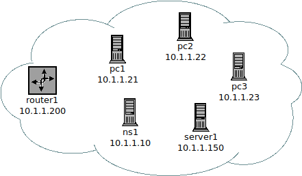

TPL 3 - Domain Name System
==========================

**Fecha de Entrega:** 08/04/2024

**URL de Entrega:** <https://tinyurl.com/TyR-2024-TP3>

**Objetivo:** Comprender el propósito, funcionamiento y servicio provisto por el Sistema de Nombres de Dominio (DNS). Familiarizarse con la estructura en árbol de nombres de dominio, con los tipos de registros de recurso y con la composición de una Zona DNS.

#### Notas para ayudantes

* Hay una muy buena presentación con teoría y práctica de DNS en
  <http://cereal.forest.usf.edu/linux/L3/w02-dns_proxy/O4L01/online-module-guide.pdf>
* Para la próxima consultar los NS de `www.telecom.com.ar` y consultar que tienen de curioso.
  (gulp.arnet.com.ar, oktubre.arnet.com.ar, lobosuelto.arnet.com.ar, corderoatado.arnet.com.ar)
* El punto 7 se refiere a las funciones que existen (llamadas a sistema operativo)
  para hacer consultas DNS en un programa que uno está escribiendo. Vale decir,
  si se está programando en C/C++, qué funciones se utilizan para convertir un
  nombre de host en IP y viceversa, por ejemplo.
* Respecto al punto 8, entre los Top-Level-Domains, como también entre los
  subdominios que figuran dentro de .ar, .es, etc. hay dominios o zonas que son
  especiales y para obtener un subdominio dentro de ellas es necesario cumplir
  ciertos requisitos adicionales. Vale decir, no cualquiera puede obtener un
  dominio de estos tipo. Un ejemplo es ".mil", a nivel global, y ".mil.ar" a
  nivel nacional, donde ambos están reservados para ciertas organizaciones.
  La idea es que los estudiantes investiguen sobre algunos de estos dominios o
  zonas especiales y qué requisitos hay que cumplir para obtener un subdominio
  dentro de ".org.ar".

Ejercicio removido en 2018 por florge-maurom
8. Acceda a la herramienta en línea de reporte DNS <http:/www.howismydns.com/> y solicite chequear el dominio
`unlu.edu.ar`. Describa al menos 3 de los chequeos/verificaciones realizados y los resultados obtenidos.

#### --- Fin notas para ayudantes ---

### Consignas

1. Utilizando la herramienta `dig` (o `nslookup`) realice consultas al servidor DNS indicado por el docente, (o desde su hogar al provisto por su ISP, o bien alguno de acceso público tal como `8.8.8.8` o `1.1.1.1`) para obtener la siguiente información:

    a. ¿Cuál es la dirección IP del host `cidetic.unlu.edu.ar`?
    b. ¿Cuál es la dirección IP del host `cacic2023.unlu.edu.ar`? ¿Qué diferencia nota en la respuesta respecto al punto anterior?
    c. ¿Cuáles son los intercambiadores de mail (mnemónico y dirección IP) del dominio `uncu.edu.ar`?
    d. ¿Cuál es el nombre del host cuya dirección IP es `190.104.80.8`?
    e. ¿Cuáles son los servidores de nombres (mnemónicos y dirección IP) para el dominio `ripe.net`?
    f. ¿Cuál es la dirección IPv6 del host `www.isoc.org`?

2. Utilice la herramienta DNS BAJAJ disponible en <http://www.zonecut.net/dns/> para obtener información en forma de grafo acerca del dominio `cruzroja.org.ar`. ¿Cuáles son los servidores (nombre y dirección IP) para dicho dominio?

3. ¿En dónde se encuentra la copia mas cercana de un servidor dns raíz? ¿Cuál es el nombre del servidor replicado (o servidores)?

4. Defina cómo estará compuesta la base de datos de un servidor DNS administrado por Ud., de manera tal que sea el servidor primario del dominio `SU-NRO-LEGAJO.tyr.example` (`.example` es un TLD reservado para uso en documentación y ejemplos). De acuerdo al diagrama de la Figura 1, defina:

    { width=35% }

    a. El nombre de todos los hosts en el nuevo dominio, y su respectivo puntero reverso.
    b. Los hosts `pc1` y `ns1` como name servers del dominio.
    e. `www.SU-NRO-LEGAJO.tyr.example` y `ftp.SU-NRO-LEGAJO.tyr.example` como alias de server1.

    Complete la planilla adjunta a partir de las definiciones previas.

5. Instale e inicie en el entorno kathara el laboratorio de dns provisto por los docentes disponible en <https://github.com/redesunlu/kathara-labs/blob/main/tarballs/kathara-lab_dns.tar.gz> y realice las siguientes actividades:

    a. Inicie una captura desde el host.
    b. Desde _pc1.lugroma3.org_, ejecute el comando `ping -c 4 pc2.nanoinside.net`
    c. Una vez recibidas las 4 respuestas ICMP, detenga la captura.
    d. Analice la captura y describa cómo es el proceso de resolución de nombres para determinar la dirección ip de _pc2.nanoinside.net_, representando gráficamente el intercambio de mensajes dns, e indicando el propósito de cada uno.
    d. Identifique el host que realiza una consulta recursiva y cuál consultas iterarivas.

6. Analice la captura `captura_ejemplo_dns.pcap` y represente el intercambio de mensajes. ¿Puede indicar alguna particular que observe en la misma?

7. ¿Cómo un desarrollador de aplicaciones puede acceder al servicio DNS? (Por ej. si es necesario resolver, en una aplicación de software, mnemónicos a direcciones IP o viceversa)

#### Bibliografía

* FOROUZAN, B.A. Transmisión de Datos y Redes de Comunicaciones. 4o ed. McGraw Hill. 2007. Capítulo 25: Sección 25.1-25.4 “Sistema de nombres de dominio”

#### Adicional
* GORALSKI, W. 2017. Capítulo 23: "The Domain Name System" en _The Illustrated Network: How TCP/IP Works in a Modern Network (2nd ed)_. Morgan Kaufmann.
  <https://www.sciencedirect.com/science/book/9780128110270>

* HERTZOG, R., MAS, R., Capítulo 10.6: “Servidores de nombres de dominio (DNS)” en El libro del administrador de Debian. Disponible en http://debian-handbook.info/browse/es-ES/stable/sect.domain-name-servers.html

*  LUPI, F. 2014. Capítulo 26: “The Domain Name System” en The NetBSD Guide. The NetBSD
Foundation. Disponible en https://www.netbsd.org/docs/guide/en/chap-dns.html

### Preguntas (guía de lectura)

¿Cuál es el objetivo del sistema DNS?

¿Porqué es un sistema y no solamente un protocolo? Descríbalo indicando estructura, elementos que intervienen y
tipos de datos (Resource Records) típicos que se pueden consultar.

El protocolo DNS puede utilizar como protocolo de transporte tanto UDP como TCP. ¿En qué casos se utiliza cada uno y cuál es la razón?

¿Quién tiene a su cargo la administración de los nombres de dominio bajo el dominio `.ar`? ¿Qué y cuáles son las zonas especiales? ¿Qué requisito especial se requiere para solicitar un dominio `.org.ar`?

\pagebreak

Documentación de configuración de la zona `SU-NRO-LEGAJO.tyr.example`
===============================================================

    Nombre de la zona DNS: ______________.tyr.example
    Nombre del servidor DNS: ______.____________.tyr.example
    Dirección de correo del contacto: _______________________________
    Número de serie de la zona: ___________
    Tiempo de vida en caché: _____ segundos

#### Resource Records (RR) para *.SU-NRO-LEGAJO.tyr.example

| Nombre de Host | Clase | Tipo de RR | Datos del RR     | Comentario |
| -------------- | :---: | :--------: | ---------------- | ---------- |
| router1        |  IN   |     A      | 10.1.1.200       | (ejemplo)  |
|                |  IN   |            |                  |            |
|                |  IN   |            |                  |            |
|                |  IN   |            |                  |            |
|                |  IN   |            |                  |            |
|                |  IN   |            |                  |            |
|                |  IN   |            |                  |            |
|                |  IN   |            |                  |            |
|                |  IN   |            |                  |            |
|                |  IN   |            |                  |            |
|                |  IN   |            |                  |            |

#### Zona de Punteros Reversos

| Nombre de Host            | Clase | Tipo de RR | Datos del RR         | Comentario |
| --------------------------| :---: | :--------: | -------------------- | ---------- |
| 200.1.1.22.in-addr.arpa.  |  IN   |    PTR     | pc2.LEGAJO.tyr.example | (ejemplo)  |
|                           |  IN   |            |                      |            |
|                           |  IN   |            |                      |            |
|                           |  IN   |            |                      |            |
|                           |  IN   |            |                      |            |
|                           |  IN   |            |                      |            |
