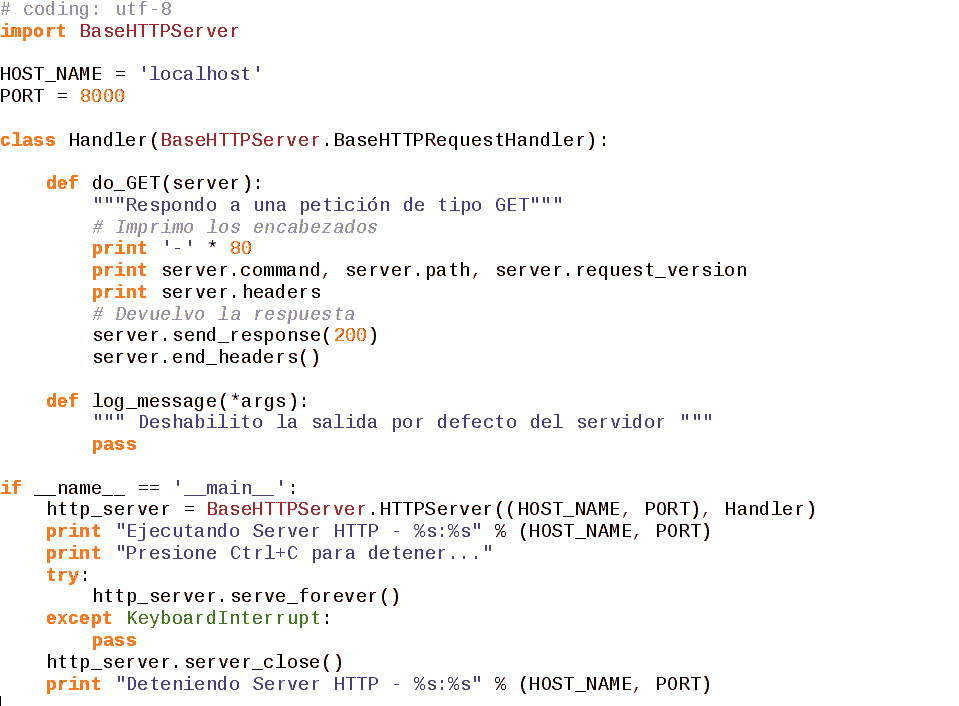

TPL 5 - World Wide Web - HTTP
=======================================================

**Fecha de Entrega:** Luján 26/04/2018

#### Notas para ayudantes

**Objetivo:** _TODO_

- Al final de este documento están las expectativas de respuesta para los
  ejercicios 11 a 14 que involucran python.

#### Consignas

#### --- Fin notas para ayudantes ---

1. Describa someramente el protocolo HTTP. Indique modo de operación y primitivas básicas.

2. ¿Qué es HTML? ¿Qué especifica? Ejemplifique.

3. Utilizando la herramienta `nc`, conéctese a la dirección y al puerto del servidor web `www.unlu.edu.ar` y lleve a cabo las siguientes pruebas utilizando primitivas del protocolo HTTP. Guarde las respuestas obtenidas.

    a. Petición por protocolo HTTP versión 1.0

            $ nc -C www.unlu.edu.ar 80 (enter)
            GET / HTTP/1.0 (enter) (enter)

    b. Petición por protocolo HTTP versión 1.1

            $ nc -C www.unlu.edu.ar 80 (enter)
            GET / HTTP/1.1 (enter)
            Host: www.unlu.edu.ar (enter) (enter)

    c. Petición HTTP. Copie el texto de la petición (indicada bajo la línea) y péguelo una vez establecida la
conexión con `nc`. Finalice la petición pulsando **tres veces** la tecla Enter.

            $ nc -C www.unlu.edu.ar 80
            GET / HTTP/1.1
            Host: www.tyr.unlu.edu.ar
            Connection: keep-alive

    d. Petición HTTP. Copie el texto de la petición (indicada bajo la línea) y péguelo una vez establecida la
conexión con `nc`. Finalice la petición pulsando **tres veces** la tecla Enter.

            $ nc -C www.unlu.edu.ar 80
            GET / HTTP/1.1
            Host: www.tyr.unlu.edu.ar
            Connection: close

    Responda:

    1. ¿Qué códigos numéricos de respuesta HTTP devuelve el servidor web para cada petición? ¿Qué significan según la RFC?
    2. ¿Cuales son los otros encabezados devueltos y qué contenido es transferido en cada caso?
    3. ¿Qué diferencia nota respecto a la duración de la conexión contra el servidor en los dos últimos casos?

4. Instale e inicie el servidor HTTP Apache en su equipo (paquete `apache2`). Inicie una captura de paquetes, filtrando por la dirección del cliente o del servidor. En otro host  de la red, realice  una petición HTTP al servidor web (indicando la dirección IP en el campo URL) utilizando al menos 2 navegadores gráficos diferentes (ej: Firefox o Iceweasel, Chrome o Chromium, Konqueror, Epiphany) y 1 navegador web en modo texto (ej: w3m, lynx, links).

    a. ¿Qué encabezados envía cada cliente en la petición? 
    b. Comente las características de la información en tránsito con respecto a la confidencialidad. 

5. Describa cómo opera un cliente HTTP (por ejemplo un navegador web) para recuperar una página HTML que contiene varios objetos. Analice la captura del archivo `captura_ejemplo_http.pcap` provisto por los docentes y represente el intercambio de mensajes mediante un gráfico ideado por Ud. ¿Qué primitivas se utilizan en cada caso?.

6. ¿Qué es un servidor Proxy? ¿En qué situaciones se implementa? Brinde ejemplos.

7. Instale e inicie en el entorno **Netkit** el laboratorio de proxy HTTP provisto por los docentes, disponible en <http://www.unlu.edu.ar/~tyr/netkit/netkit-lab_proxy-TYR.tar.gz>

    Este laboratorio comprende tres hosts: uno actúa como servidor web (con el servicio Apache2 en ejecución), uno actúa como cliente web (con el navegador Lynx instalado) y uno actúa como proxy HTTP (con el servicio Squid en ejecución).

    a. Averigüe y tome nota de las dirección IP asignada al Proxy en su interfaz `eth1`.

    b. En el cliente, configure que las peticiones HTTP se realicen a través de proxy. Para ello, establezca
la variable de entorno `HTTP_PROXY` como se muestra a continuación. Esto es equivalente a configurar las variables "Servidor proxy" y "Puerto" en los navegadores gráficos y en los celulares.

            export http_proxy=http://DIRECCION_IP_PROXY:3128

    c. Inicie una captura desde el host redirigiendola a un archivo para su posterior análisis:

            vdump A > nombre_archivo.pcap

    d. En el cliente, navegue hacia la dirección <http://169.254.0.1/> utilizando un browser de consola:

            lynx http://169.254.0.1/

        Dicha dirección IP es la correspondiente al host servidor web.

    e. Detenga la captura y analice el mensaje que aparece en pantalla. ¿Qué código de respuesta HTTP se retornó? Cierre el navegador web pulsando la tecla `q`

    f. La configuración de fábrica del software proxy Squid impide que los clientes naveguen a través de él. Para resolverlo, busque el archivo `/etc/squid/squid.conf` dentro del host proxy, edítelo y reemplace la línea

            # http_access allow localnet

        por

            http_access allow localnet

    g. Guarde los cambios y reinicie el proceso que actúa como proxy mediante el comando

            service squid restart

        De esta manera, el software Squid admitirá peticiones que realicen clientes que estén accediendo desde redes privadas (10.0.0.0/8, 192.168.0.0/16 y otras).

    h. Inicie una nueva captura y vuelva a realizar la petición del punto **d**.

    i. Indique qué mensaje aparece en pantalla. Cierre el navegador web pulsando la tecla **q**

    Detenga la captura, analícela y responda:

    1. ¿Qué encabezados envía el cliente al proxy-http en la petición? 
    2. ¿Qué encabezados envía el proxy-http al servidor web en la petición? 
    3. Mencione las diferencias que observa en los encabezados respecto a no utilizar un proxy-http (punto 4)
    4. ¿Es posible cambiar el número de puerto TCP en el que escucha el servidor proxy? ¿Qué línea del archivo de configuración hay que cambiar para que Squid escuche por conexiones en el puerto 8080?

8. ¿Cómo un sistema que realiza caché local puede determinar si algún objeto en el servidor original fue modificado con respecto a la copia actual, sin realizar la transferencia completa del objeto? 

9. ¿Qué es la interfaz CGI? ¿Para qué se utiliza? 

10. ¿De qué formas un programa puede recibir parámetros por medio de la interfaz CGI? Comente las diferencias en el modo de operación en cada caso.

Para los ejercicios 11 a 14 deberá utilizar el intérprete de lenguaje Python versión 2.x disponible para múltiples plataformas y sistemas operativos. En los sistemas operativos Linux el intérprete usualmente está
instalado por defecto. Si bien no es estrictamente necesario ninguna introducción "fuerte" en el lenguaje, se
recomienda leer los primeros capítulos del tutorial en español indicado en las referencias de este trabajo.

11. Ejecute el siguiente comando en la consola de Linux, en el home del usuario (`/home/alumno`):

        alumno@lab1:~$ python -m SimpleHTTPServer

    Luego, abra un navegador web e ingrese a la URL <http://localhost:8000>

    a. ¿Qué es lo que se ve en el navegador?
    b. ¿Cuál es la salida por consola del programa Python? ¿Qué puede interpretar de ella?
    c. Abra un archivo de extensión `.html` en el directorio home del usuario. Si no existiera alguno, genere uno escrito por usted. ¿Qué sucede al abrirlo con el navegador web?

12. Escriba en un editor de texto el script en página siguiente y guárdelo en el archivo `http1.py`

    { width=14cm }

    Es importante destacar al momento de escribir el código, que en el lenguaje Python los espacios son utilizados para definir el nivel de anidamiento de la sentencia (ya que como se ve, no se utilizan llaves); por lo tanto, debe respetarse la sintaxis y todos los espacios del ejemplo.

    Ejecute el script servidor HTTP con el comando `python http1.py`  
    Luego, abra un navegador web e ingrese a la URL <http://localhost:8000>

    a. ¿Qué es lo que se ve en el navegador?
    b. ¿Cuál es la salida por consola del servidor http? ¿Qué puede interpretar de la misma?
    c. Experimente y compare las diferencias en la salida del servidor web:
        - Con otros navegadores o clientes http, 
        - Recargando la página con Ctrl+F5,
        - Ingresando a la URL <http://localhost:8000/test/de/url/>

        ¿Qué diferencias aprecia y a causa de qué?

    d. En el navegador (Firefox o Chromium/Chrome), presione la combinación de teclas `Ctrl+Shift+I`, lo que da lugar a la apertura del depurador del navegador. Entre otras cosas, éste posee una pestaña o apartado llamado "Red", que permite examinar cómo la página web es obtenida por el navegador, recurso por recurso.  
    Seleccione haciendo clic sobre la petición hecha al servidor web local y describa qué encabezados devolvió el servidor escrito en Python.

\pagebreak

13. Escriba en un editor de texto el siguiente script [^1] y guárdelo en el archivo `http2.py`

~~~~~~~python
# coding: utf-8
import BaseHTTPServer
 
HOST_NAME = 'localhost'
PORT = 8000
 
class Handler(BaseHTTPServer.BaseHTTPRequestHandler):
 
    def do_GET(server):
        """Respondo a una petición de tipo GET"""
        # Imprimo los encabezados
        print '-' * 80
        print server.command, server.path, server.request_version
        print server.headers
        # Devuelvo la respuesta
        server.send_response(200)
        server.send_header('Content-Type', 'text/html')
        server.end_headers()
        server.wfile.write('<html><head><title>Pagina HTML de ejemplo</title>'
            '</head><body>
Esta es una prueba, con texto en <b>negrita</b>,'
            '<i>cursiva</i> e incluso una imagen externa:
'
            '</body></html>')
 
    def log_message(*args):
        """ Deshabilito la salida por defecto del servidor """
        pass
 
if __name__ == '__main__':
    http_server = BaseHTTPServer.HTTPServer((HOST_NAME, PORT), Handler)
    print 'Ejecutando Server HTTP - %s:%s' % (HOST_NAME, PORT)
    print 'Presione Ctrl+C para detener...'
    try:
        http_server.serve_forever()
    except KeyboardInterrupt:
        pass
    http_server.server_close()
    print 'Deteniendo Server HTTP - %s:%s' % (HOST_NAME, PORT)
~~~~~~~

Ejecute el script servidor HTTP con el comando `python http2.py` Luego, abra un navegador web e ingrese a la URL <http://localhost:8000> con el depurador del navegador activo.

  a. Analice cómo se obtiene la página principal y la imagen embebida en el documento.
  b. Detenga el servidor, modifique el encabezado `Content-Type` a `text/plain` y vuelva a ejecutar la prueba. ¿Qué apariencia tiene la página web y por qué?

14. Escriba en un editor de texto el siguiente script [^2] y guárdelo en el archivo `http3.py`

~~~~~~~python
# coding: utf-8

import BaseHTTPServer

HOST_NAME = 'localhost'
PORT = 8000

def detectar_so(user_agent):
    # Ver listados en http://www.useragentstring.com/pages/useragentstring.php
    if 'Linux' in user_agent:
        return 'Veo que Ud. esta usando Linux como S.O.'
    elif 'Windows' in user_agent:
        return 'Veo que Ud. esta usando Windows como S.O.'
    else:
        return 'No conozco su S.O.'

def get_pagina_ok():
    """ Función que dvuelve la página de exito de ejemplo """
    # Como alternativa podría abrirse un archivo del disco, leerlo y devolverlo
    # como cadena de texto.
    return ('<html><head><title>Pagina HTML de ejemplo</title>'
           '</head><body>
Esta es una prueba, con texto en <b>negrita</b>,'
           '<i>cursiva</i> e incluso una imagen externa:
'
           '')

class Handler(BaseHTTPServer.BaseHTTPRequestHandler):

    def do_GET(server):
        """Respondo a una petición de tipo GET"""
        # Imprimo los encabezados por consola
        print '-' * 80
        print server.command, server.path, server.request_version
        print server.headers
        # Devuelvo la respuesta
        if server.path.startswith('/ir_a/'):
            ir_a = server.path.split('/')[-1]
            server.send_response(302)
            server.send_header('Location', 'http://' + ir_a)
            server.end_headers()
        elif server.path.startswith('/no_existe'):
            server.send_response(404)
            server.send_header('Content-Type', 'text/plain')
            server.end_headers()
            server.wfile.write('Pagina no encontrada')
        else:
            server.send_response(200)
            server.send_header('Content-Type', 'text/html')
            server.end_headers()
            server.wfile.write(get_pagina_ok())
            server.wfile.write('
' + detectar_so(server.headers['User-Agent']))
            server.wfile.write('
</body></html>')

    def log_message(*args):
        """ Deshabilito la salida por defecto del servidor """
        pass

if __name__ == '__main__':
    http_server = BaseHTTPServer.HTTPServer((HOST_NAME, PORT), Handler)
    print 'Ejecutando Server HTTP - %s:%s' % (HOST_NAME, PORT)
    print 'Presione Ctrl+C para detener...'
    try:
        http_server.serve_forever()
    except KeyboardInterrupt:
        pass
    http_server.server_close()
    print 'Deteniendo Server HTTP - %s:%s' % (HOST_NAME, PORT)
~~~~~~~

Ejecute el script servidor HTTP con el comando `python http3.py` Luego, abra un navegador web e ingrese a la URL <http://localhost:8000> con el depurador del navegador activo.

a. ¿La página es siempre igual (estática) o dinámica? ¿De qué manera se intenta averiguar el Sistema Operativo del cliente?
b. ¿Qué sucede si se ingresa a la URL <http://localhost:8000/ir_a/www.unlu.edu.ar>? ¿Por qué? Analice el comportamiento con el depurador del navegador.
c. ¿Qué sucede si se ingresa a la URL <http://localhost:8000/no_existe>? ¿Por qué? Analice el comportamiento con el depurador del navegador.

[^1]: <http://pastebin.com/BThStjqY>
[^2]: <http://pastebin.com/9TW5kvA4>

**Bibliografía**

* "Comunicaciones y Redes de Computadoras", Sexta Edición, William Stallings, Prentice Hall. Capítulo 19.4: "Protocolo de Transferencia de Hipertexto (HTTP)".
* "Redes de Computadoras", Tercera Edición, Andrew Tannenbaum, Prentice Hall. Capítulo 7.6: "La World Wide Web".
* RFC 7230 - Hypertext Transfer Protocol (HTTP/1.1) Message Syntax and Routing
* RFC 7231 - Hypertext Transfer Protocol (HTTP/1.1) Semantics and Content

**Recursos en internet**

* <http://www.faqs.org> y <http://www.rfc-editor.org>
* Apache web server: <http://httpd.apache.org/>
* Squid proxy: <http://www.squid-cache.org/>
* Common Gateway Interface: <http://www.w3c.org/cgi/>
* HTML: <http://www.w3.org/TR/html/>
* Sitio web del lenguaje Python: <https://www.python.org/>
* Tutorial de Python: <http://docs.python.org.ar/tutorial/2/contenido.html>
* Guías de inicio en Python: <http://python.org.ar/AprendiendoPython>

#### Notas para ayudantes

#### Expectativas de respuesta ejercicios 11 a 14

    11.a. Qué se ve en el navegador? --> Se ve un listado de directorio.
    11.b. Qué se ve en la consola? --> Muestra las peticiones HTTP recibidas.
          Debería interpretar cada campo.
    11.c. Abrir archivo HTML. --> Se ve una página HTML interpretada.

    12.a. Qué se ve en el navegador? --> Se ve una página en blanco.
    12.b. Qué se ve en la consola? --> Se ven los encabezados HTTP por consola.
    12.c. Diferencias encabezados entre navegadores distintos, Ctrl+F5, URL.
          User-Agent, Accept, Accept-language, Accept-encoding, Cache, URL.
    12.d. Se ven los encabezados de servidor agregados por Python: Date, Server.

    13.a. El cliente hace una Petición GET HTML + Petición GET Imagen a UNLu.
    13.b. Devolución Content-Type: text/plain. Retorna el código fuente de la página.

    14.a. Página dinámica. La respuesta depende del User-Agent.
    14.b. Redirección mediante HTTP 302. Indicar header Location.
          Primero GET a proceso propio, luego GET a UNLu y a recursos afines.
    14.c. Petición a página inexistente. --> Obtiene una respuesta 404.

#### --- Fin notas para ayudantes ---
