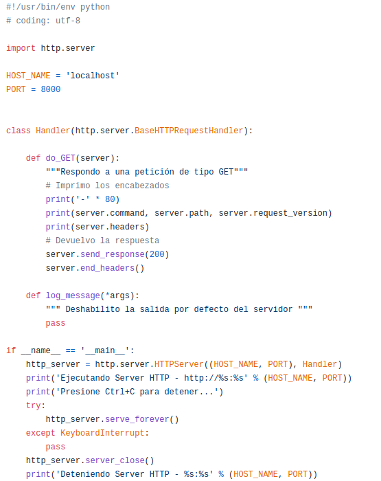

TPL 6 - World Wide Web - HTTP - Parte2
=======================================================

**Fecha de Entrega:** 15/05/2023

**URL de Entrega:** <https://tinyurl.com/TyR-2023-TP6>

**Objetivo:** Permitir la comprensión del funcionamiento de la "World Wide Web", a través del análisis de los principales protocolos y agentes que integran su arquitectura.

#### Notas para ayudantes

- florge: Segunda práctica HTTP año 2022, escindida de la versión "larga" de años anteriores.

#### --- Fin notas para ayudantes ---

#### Consignas

Para los ejercicios del presente trabajo práctico, deberá utilizar el intérprete de lenguaje Python versión 3.x disponible para múltiples plataformas y sistemas operativos. En los sistemas operativos Linux el intérprete usualmente está instalado por defecto. Si bien no es estrictamente necesario ninguna introducción "fuerte" en el lenguaje, se
recomienda leer los primeros capítulos del tutorial en español indicado en las referencias de este trabajo.

1. Ejecute el siguiente comando en la consola de Linux, en el home del usuario (`/home/alumno`):

        alumno@lab1:~$ python -m http.server

    Luego, abra un navegador web e ingrese a la URL <http://localhost:8000>

    a. ¿Qué es lo que se ve en el navegador?
    b. ¿Cuál es la salida por consola del programa Python? ¿Qué puede interpretar de ella?
    c. Abra un archivo de extensión `.html` en el directorio home del usuario. Si no existiera alguno, genere uno escrito por usted. ¿Qué sucede al abrirlo con el navegador web?

2. Escriba en un editor de texto el script en página siguiente y guárdelo en el archivo `http1.py`

    { width=14cm }

    Es importante destacar al momento de escribir el código, que en el lenguaje Python los espacios son utilizados para definir el nivel de anidamiento de la sentencia (ya que como se ve, no se utilizan llaves); por lo tanto, debe respetarse la sintaxis y todos los espacios del ejemplo.

    Ejecute el script servidor HTTP con el comando `python http1.py`
    Luego, abra un navegador web e ingrese a la URL <http://localhost:8000>

    a. ¿Qué es lo que se ve en el navegador?
    b. ¿Cuál es la salida por consola del servidor http? ¿Qué puede interpretar de la misma?
    c. Experimente y compare las diferencias en la salida del servidor web:
        - Con otros navegadores o clientes http,
        - Recargando la página con Ctrl+F5,
        - Ingresando a la URL <http://localhost:8000/test/de/url/>

        ¿Qué diferencias aprecia y a causa de qué?

    d. En el navegador (Firefox o Chromium/Chrome), presione la combinación de teclas `Ctrl+Shift+I`, lo que da lugar a la apertura del depurador del navegador. Entre otras cosas, éste posee una pestaña o apartado llamado "Red", que permite examinar cómo la página web es obtenida por el navegador, recurso por recurso.
    Seleccione haciendo clic sobre la petición hecha al servidor web local y describa qué encabezados devolvió el servidor escrito en Python.

3. Escriba en un editor de texto el siguiente script [^1] y guárdelo en el archivo `http2.py`

~~~~~~~python
#!/usr/bin/env python
# coding: utf-8

import http.server

HOST_NAME = 'localhost'
PORT = 8000

class Handler(http.server.BaseHTTPRequestHandler):

    def do_GET(server):
        """Respondo a una petición de tipo GET"""
        # Imprimo los encabezados
        print('-' * 80)
        print(server.command, server.path, server.request_version)
        print(server.headers)
        # Devuelvo la respuesta
        server.send_response(200)
        server.send_header('Content-Type', 'text/html')
        server.end_headers()
        server.wfile.write(b'<html><head><title>Pagina HTML de ejemplo</title>'
           b'</head><body>
Esta es una prueba, con texto en <b>negrita</b>,'
           b'<i>cursiva</i> e incluso una imagen externa:
'
           b'</body></html>')

    def log_message(*args):
        """ Deshabilito la salida por defecto del servidor """
        pass

if __name__ == '__main__':
    http_server = http.server.HTTPServer((HOST_NAME, PORT), Handler)
    print('Ejecutando Server HTTP - http://%s:%s' % (HOST_NAME, PORT))
    print('Presione Ctrl+C para detener...')
    try:
        http_server.serve_forever()
    except KeyboardInterrupt:
        pass
    http_server.server_close()
    print('Deteniendo Server HTTP - %s:%s' % (HOST_NAME, PORT))
~~~~~~~

Ejecute el script servidor HTTP con el comando `python http2.py` Luego, abra un navegador web e ingrese a la URL <http://localhost:8000> con el depurador del navegador activo.

  a. Analice cómo se obtiene la página principal y la imagen embebida en el documento.
  b. Detenga el servidor, modifique el encabezado `Content-Type` a `text/plain` y vuelva a ejecutar la prueba. ¿Qué apariencia tiene la página web y por qué?

4. Escriba en un editor de texto el siguiente script [^2] y guárdelo en el archivo `http3.py`

~~~~~~~python
#!/usr/bin/env python
# coding: utf-8

import http.server

HOST_NAME = 'localhost'
PORT = 8000

def detectar_so(user_agent):
    # Ver listados en http://www.useragentstring.com/pages/useragentstring.php
    if 'Linux' in user_agent:
        return b'Veo que Ud. esta usando Linux como S.O.'
    elif 'Windows' in user_agent:
        return b'Veo que Ud. esta usando Windows como S.O.'
    else:
        return b'No conozco su S.O.'

def get_pagina_ok():
    """ Función que dvuelve la página de exito de ejemplo """
    # Como alternativa podría abrirse un archivo del disco, leerlo y devolverlo
    # como cadena de texto.
    return (b'<html><head><title>Pagina HTML de ejemplo</title>'
            b'</head><body>
Esta es una prueba, con texto en <b>negrita</b>,'
            b'<i>cursiva</i> e incluso una imagen externa:
'
            b'')

class Handler(http.server.BaseHTTPRequestHandler):

    def do_GET(server):
        """Respondo a una petición de tipo GET"""
        # Imprimo los encabezados por consola
        print('-' * 80)
        print(server.command, server.path, server.request_version)
        print(server.headers)
        # Devuelvo la respuesta
        if server.path.startswith('/ir_a/'):
            ir_a = server.path.split('/')[-1]
            server.send_response(302)
            server.send_header('Location', 'http://' + ir_a)
            server.end_headers()
        elif server.path.startswith('/no_existe'):
            server.send_response(404)
            server.send_header('Content-Type', 'text/plain')
            server.end_headers()
            server.wfile.write('Pagina no encontrada')
        else:
            server.send_response(200)
            server.send_header('Content-Type', 'text/html')
            server.end_headers()
            server.wfile.write(get_pagina_ok())
            server.wfile.write(bytes(b'
' + detectar_so(server.headers['User-Agent'])))
            server.wfile.write(b'
</body></html>')

    def log_message(*args):
        """ Deshabilito la salida por defecto del servidor """
        pass

if __name__ == '__main__':
    http_server = http.server.HTTPServer((HOST_NAME, PORT), Handler)
    print('Ejecutando Server HTTP - http://%s:%s' % (HOST_NAME, PORT))
    print('Presione Ctrl+C para detener...')
    try:
        http_server.serve_forever()
    except KeyboardInterrupt:
        pass
    http_server.server_close()
    print('Deteniendo Server HTTP - %s:%s' % (HOST_NAME, PORT))
~~~~~~~

Ejecute el script servidor HTTP con el comando `python http3.py` Luego, abra un navegador web e ingrese a la URL <http://localhost:8000> con el depurador del navegador activo.

a. ¿La página es siempre igual (estática) o dinámica? ¿De qué manera se intenta averiguar el Sistema Operativo del cliente?
b. ¿Qué sucede si se ingresa a la URL <http://localhost:8000/ir_a/www.unlu.edu.ar>? ¿Por qué? Analice el comportamiento con el depurador del navegador.
c. ¿Qué sucede si se ingresa a la URL <http://localhost:8000/no_existe>? ¿Por qué? Analice el comportamiento con el depurador del navegador.

[^1]: <https://bit.ly/http-2-tyr>
[^2]: <https://bit.ly/http-3-tyr>

**Bibliografía**

* FOROUZAN, B.A. TCP IP Protocol Suite. McGraw-Hill Higher Education, 2009. Capítulo 22: “World Wide Web and HTTP”
* RFC 7230 - Hypertext Transfer Protocol (HTTP/1.1) Message Syntax and Routing
* RFC 7231 - Hypertext Transfer Protocol (HTTP/1.1) Semantics and Content

**Recursos en internet**

* <http://www.faqs.org> y <http://www.rfc-editor.org>
* HTML: <http://www.w3.org/TR/html/>
* Sitio web del lenguaje Python: <https://www.python.org/>
* Tutorial de Python: <http://docs.python.org.ar/tutorial/3/index.html>
* Guías de inicio en Python: <http://python.org.ar/AprendiendoPython>

#### Notas para ayudantes

Esta bibliografía queda aparte pues no figura en el listado realizado en 2020
* STALLINGS, W. 2002. 19.4: "Protocolo de Transferencia de Hipertexto (HTTP)" en _Comunicaciones y Redes de Computadoras (6ta ed)_. Prentice Hall.
* TANNEMBAUM, A. Capítulo 7.6: "La World Wide Web" en _Redes de Computadoras (3ra ed)_. Prentice Hall.
* GORALSKI, W. 2017. Capítulo 26: "Hypertext Transfer Protocol" en _The Illustrated Network: How TCP/IP Works in a Modern Network (2nd ed)_. Morgan Kaufmann.
  <https://www.sciencedirect.com/science/book/9780128110270>

#### Expectativas de respuesta ejercicios 1 a 4

    1.a. Qué se ve en el navegador? --> Se ve un listado de directorio.
    1.b. Qué se ve en la consola? --> Muestra las peticiones HTTP recibidas.
          Debería interpretar cada campo.
    1.c. Abrir archivo HTML. --> Se ve una página HTML interpretada.
    
    2.a. Qué se ve en el navegador? --> Se ve una página en blanco.
    2.b. Qué se ve en la consola? --> Se ven los encabezados HTTP por consola.
    2.c. Diferencias encabezados entre navegadores distintos, Ctrl+F5, URL.
          User-Agent, Accept, Accept-language, Accept-encoding, Cache, URL.
    2.d. Se ven los encabezados de servidor agregados por Python: Date, Server.
    
    3.a. El cliente hace una Petición GET HTML + Petición GET Imagen a UNLu.
    3.b. Devolución Content-Type: text/plain. Retorna el código fuente de la página.
    
    4.a. Página dinámica. La respuesta depende del User-Agent.
    4.b. Redirección mediante HTTP 302. Indicar header Location.
          Primero GET a proceso propio, luego GET a UNLu y a recursos afines.
    4.c. Petición a página inexistente. --> Obtiene una respuesta 404.

#### --- Fin notas para ayudantes ---
