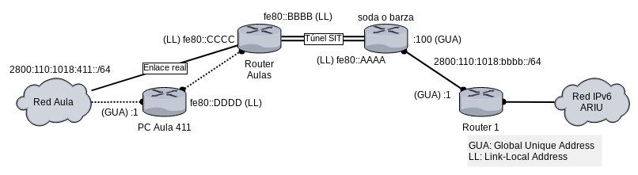

Clase Teórico-Práctica de Protocolo IPv6
========================================

#### Notas para ayudantes

(falta incluir el gráfico de topología IPv6 del Aula para 2018)

Definir un equipo que operará de router entre el uplink y la red del aula, a fin de separar los enlaces para que la captura en el aula sea lo más limpia posible. **Validar que la boca 24 es la de uplink**.

Si fuera necesario establecer autoconfiguración dinámica en Debian, agregar lo siguente en `/etc/network/interfaces`

    auto-hotplug INTERFAZ
    iface INTERFAZ inet6 auto

Recordar que si bien RADVD puede enviar el DNS como una opción dentro del Router Advertisement, aún no es posible que los sistemas Debian tomen el DNS y lo configuren en `resolv.conf`.

#### Configuración para salir con IPv6 desde el Aula 411

Lo más sencillo es utilizar túnel para portar IPv6 sobre IPv4 entre el router de las aulas (que NO tiene IPv6) hasta _barza_ o _router1_ (que tienen IPv6) o bien soda (que puede tener IPv6) según lo indicado en <https://juncotic.com/tunel-ipv6-montando-tunel-ipv6/>

En el caso de querer utilizar el equipo _soda_ para salir por IPv6, previamente asignar la siguiente dirección al mismo y habilitar ruteo:

    # dar direccion ipv6 de red unlu
    ip address add 2800:110:1018:bbbb::37/64 dev enp1s0
    ip route add default via 2800:110:1018:bbbb::1 dev enp1s0

    # crear tunel contra router aulas
    ip tunnel add net6tun mode sit remote 170.210.101.126 local 170.210.96.37
    ip link set net6tun up
    ip route add 2800:110:1018:411::/64 dev net6tun

    sysctl -w net.ipv6.conf.all.forwarding=1
    # establecer reglas de fw para permitir forwarding de trafico ipv6

En el router 1 (central)

    ip route add 2800:110:1018:411::/64 via 2800:110:1018:bbbb::37 dev INTERFAZ

En el router de Aulas

    ip tunnel add net6tun mode sit remote 170.210.96.37 local 170.210.101.126
    ip link set net6tun up
    ip route add ::/0 dev net6tun
    ip route add 2800:110:1018:411::/64 via fe80::...:9999 dev eth0    # <-- aqui fe80::...:9999 es la Link-Local del equipo del aula
    sysctl -w net.ipv6.conf.all.forwarding=1
    # establecer reglas de fw para permitir forwarding de trafico ipv6

En UNO de los equipos del aula, que actuará como router local

    ip addr add 2800:110:1018:411::1/64 dev eth1
    ip route add ::/0 via fe80::...:126 dev eth0    # <-- aqui fe80::...:126 es la Link-Local del router de Aulas
    sysctl -w net.ipv6.conf.all.forwarding=1

En cualquiera de los equipos del laboratorio

    ip addr add 2800:110:1018:411::xx/64 dev eth0
    ip route add ::/0 via 2800:110:1018:411::1 dev eth0

Nota: para restablecer todo una vez realizada la práctica, quitar las rutas, las direcciones y las interfaces del tunel mediante `ip [route|address|tunel] del` y quitar el módulo SIT mediante `modprobe -r sit`.

### Teoría sobre IPv6

Los siguientes esquemas documentan lo que se explica del protocolo en la clase de IPv6. Están tomados de los videos del Curso IPv6 Básico de LACNIC.

#### Definición del protocolo IPv6

- Soluciones paliativas a la escasez de direcciones IPv5
    - CIDR (Prefijo/Máscara)
    - DHCP (Asignación dinámica)
    - NAT + RFC 1918 (Privadas)
- Desafíos
    - Escalabilidad
    - Seguridad
    - Configuración y administración de red
    - Soporte QoS
    - Movilidad
    - Políticas de ruteo
    - Transición
- 1992 Creación del grupo IPng
- 1998 IPv6 RFC 2460
    - 128 bits para direccionamiento
    - Cabezal base simplificado
    - Cabezales de extensión
    - Identificador de flujo de datos (QoS)
    - Mecanismos de IPSec incorporados al protocolo
    - Fragmentación y reensamblado en extremos
    - No requiere de uso de NAT
        - Permite la enumeración de todos los dispositivos en el planeta
    - Mecanismos que facilitan la configuración de la red

#### Mecanismos de Transición

- Transición y coexistencia con IPv4
    - No compatibles entre sí
    - Estrategias de transición
        - En orden de preferencia!
        - IPv6 nativo: cabecera IPv6 nativa desde origen hasta destino
            - Puede ser dual-stack o sólo-ipv6
        - Túneles: encapsulan una versión de IP en otra
        - Traducción: necesaria para comunicar dos hosts que hablan sólo una
          versión y tales son diferentes entre sí

#### Cabezal Básico IPv6

- Cabecera básica IPv6
    - IPv6 es una evolución de IPv4, pero con un header simplificado
    - Cabecera alineada a 64 bits (vs 32 de IPv4) por performance en x64
    - Longitud fija de 40 bytes (de la cabecera básica)
    - Campos
        - Versión
        - Traffic Class (QoS) = ToS en IPv4
        - Flow label (QoS) de 20 bits
        - Payload length
        - Next Header = Protocol en IPv4
        - Hop Limit = TTL en IPv4
        - Source Address de 128 bits (16 bytes)
        - Destination Address de 128 bits (16 bytes)
    - Cambios respecto de IPv4
        - Pasa de 12 a 8 campos
        - Elimina el campo de tamaño variable Options --> ahora el header es de tamaño fijo
            - Se reemplaza por headers de extensión
        - Elimina el campo IHL o Header-Len pues la cabecera es de tamaño fijo
        - Elimina el checksum en capa 3 pues se considera redundante
          (existe en capa 2, en 4 en el caso de TCP, y generalmente en aplicación)
        - Mueve los campos relacionados con fragmentación (Identification,
          Flags y Fragment-Offset) a un encabezado de extensión.
    - Ventajas
        - Simplificado, tamaño fijo y alineado a 64 bits
            - Mejor performance en routers y mejor escalabilidad
            - Se descarga complejidad en el core de la red (routers) y se traslada al borde (extremos): fragmentación, reensamblado.
        - Elimina funcionalidades redundantes y no necesarias
            - Checksum y Header-Length
        - Campo específico para QoS: Flow label
- Cabeceras de extensión IPv6
    - Añaden funcionalidad a la capa IP, haciendola flexible
    - Limitadas y ordenadas. Usadas a lo sumo una vez (excepto Destination)
    - (IPv6)
    - Hop-by-Hop (procesado por cada router)
    - Destination (procesado por routers en el header de extensión Routing)
    - Routing (lista los routers por los cuales debe atravesar)
    - Fragmentation (procesado en destino)
    - Authentication (IPSec, procesado luego de ensamblar el paquete)
    - ESP (IPSec, permite cifrar la información restante)
    - Destination (procesado sólo por el destino)
    - (Upper Layer / Payload)
    - La mayoría de las cabeceras de extensión se procesan en el destino

#### Características generales de IPv6

- **Notación de direcciones IPv6**
    - Espacio de direcciones
        - 128 bits de direccionamiento = 2^128
        - 3.4 x 10^38 direcciones
    - Reglas de notación de direcciones
        - 8 grupos de 16 bits separados por dos puntos ":"
        - Notación hexadecimal de cada nibble (4 bits)
        - Sin distinción entre mayúsculas y minúsculas
    - Reglas de compresión
        - Ceros a la izquierda de cada grupo se pueden comprimir
        - Uno o más grupos con todos ceros se pueden cambiar por "::" pero sólo una vez en toda la dirección.
            - Es decir, no puede haber dos "::" pues da lugar a ambigüedades
    - Para especificar dirección y puerto, usar corchetes
        - Ej: `http://[2001:db8::10]:8080/`
- Prefijos
    - Siguen la notación CIDR al igual que en IPv4 (prefijo/longitud)
    - Se pueden aplicar las reglas de compresión recién vistas
    - Los bits que exceden el prefijo pueden utilizarse para subnetting
- **Tipos de direcciones**
    - Unicast (uno-a-uno)
        - Link-local (tienen sentido sólo en el enlace de capa 2) (`fe80::/10`)
        - Unique-local o ULA (tienen sentido sólo en una org) (`fc00::/7`)
        - IPv4-mapped (`::ffff:IPv4/128`)
        - Global o GUA (`2000::/3`) (Binario 0010)
        - Obsoletas:
            - Site-local (`fec0::/10`)
            - IPv4-compatible (`::IPv4/128`)
    - Multicast (uno-a-varios) (`ff00::/8`)
    - Anycast (uno-al-más-cercano) (toma direcciones del espacio unicast)
    - No hay direcciones broadcast --> son un tipo particular de multicast conocidas
        - `ff02::1 o ff02::2`
    - Reservadas
        - Mecanismos de transición
        - Documentación (`2001:db8::/32`)
        - Loopback (`::1/128`) = 127.0.0.1
        - No especificado (`::/128`) = 0.0.0.0
- Direcciones Link-local
    - Válida sólo en un enlace de capa 2
    - Siempre presente en una interfaz con IPv6 activado
    - En la práctica se usa el prefijo `fe80::/64`
    - La Interface ID (los 64 bits de menor peso) se genera localmente en el host, a partir de la MAC, o bien aleatoriamente o mediante otros mecanismos.
- Direcciones Unique-local o ULA
    - Prefijo `fc00::/7`
        - `fc01` si el prefijo es asignado localmente
    - `fc00` debe definirse en el futuro (RFC 4193), pero en la práctica se utiliza para prefijos asignados centralmente.
    - Luego sigue un global ID de 40 bits que es generado pseudo-aleatoriamente, dando lugar a un prefijo /48 que normalmente comienza con `fd00::/8` (?)
- Direcciones multicast
    - Prefijo `ff00::/8`
    - Luego siguen 4 bits de flags utilizados para routing y servicios multicast
    - Luego siguen 4 bits que definen el alcance o scope
        - 1: interface-local (host)
        - 2: link-local (capa 2)
        - 4: admin-local
        - 5: site-local
        - 8: organization-local
        - E: global
    - Finalmente siguen los 112 bits que identifican al grupo multicast
    - Sustituyen las direcciones broadcast de IPv4
- Direcciones multicast conocidas
    - `ff01::1, ff02::1` --> todos los nodos en el ámbito del host (1) o en el ámbito del enlace (2).
    - `ff01::2, ff02::2, ff05::2` --> todos los routers en nodo (1), en el enlace (2) o en el sitio (5).
    - Dirección Solicited Node (SN) multicast a partir de la unicast
        - Si la dirección termina en `XY:ZTUV` la SN es `ff02::1:ffXY:ZTUV`
    - Cada nodo IPv6 debe unir la dirección SN a todas sus direcciones unicast y anycast.
- Identificadores de Interfaz (IID)
    - IID (Interface ID) son los 64 bits finales que identifican los hosts en una LAN
    - Se pueden crear de muchas maneras
        - Usando direcciones MAC de las interfaces (EUI-64)
        - Automáticamente mediante algún algoritmo (aleatorio RFC 4941)
        - Manualmente
        - Mediante DHCPv6
    - Idea Importante:
        - El prefijo de red en una LAN será /64, siendo ésta la unidad mínima que se manejará en planes de numeración / direccionamiento.
- Identificadores de Interfaz según EUI-64
    - IEEE define un mecanismo para crear una EUI-64 a partir de una dirección IEEE 802 MAC (Ethernet, FDDI)
    - El IID se obtiene modificando el EUI-64 en el bit "u" (Universal).
      Se pone 1 para indicar alcance universal y 0 para indicar alcance local.

        |          24 bits         | 16 bits |    24 bits    |          |
        |--------------------------|:-------:|---------------|----------|
        | x x x x x x U G  vendor  |   fffe  | serial number | <-- EUI  |
        | x x x x x x 1 G  vendor  |   fffe  | serial number | <-- IID  |
          1 2 3 4 5 6 7 8

#### Planes de numeración

- Longitudes de prefijo IPv6
  - Cualquier LAN con varios hosts              -->  /64
  - Direcciones loopback                        --> /128
  - Punto a punto entre operador y CPE usuario  -->  /64
  - Punto a punto entre dos routers             -->  /64
  - Prefijo delegado a usuarios finales         -->  /48
  - Preferentemente se delega un prefijo estático
  - Tener en cuenta previsiones de crecimiento

#### Autoconfiguración - Protocolos asociados

- Introducción
    - Diferencias vs IPv4
    - Desaparecen las direcciones de Broadcast, siendo reemplazadas por direcciones Multicast
    - Deja de utilizarse ARP, siendo reemplazado por NDP
    - Mayor utilización de ICMPv6, que da soporte a NDP, MLD y MIPv6 (Mobile IPv6)
- ICMPv6
    - Cuidado con el filtrado de mensajes! ICMPv6 es fundamental para el correcto funcionamiento del protocolo IPv6.
- Path MTU Discovery
    - MTU = Maximum Transmission Units
        - Link MTU: máximo número de bytes que puede poseer el paquete IP, según el tamaño máximo del payload de la capa de enlace.
        - Path MTU: mínimo link-mtu desde origen hasta destino
    - En IPv6, el Link-MTU mínimo es 1280 bytes (en IPv4 era 68 bytes)
    - Importante en IPv6 pues:
        - El proceso de fragmentación cambia: sólo puede fragmentar el origen y se requiere de una cabecera de extensión.
        - El encapsulado es frecuente: el overhead reduce el MTU disponible
    - Path MTU Discovery para IPv6 está definido en la RFC 1981
        - Descubre de forma proactiva el Path-MTU del camino en base al envío de paquetes mayores de 1280 bytes comenzando desde el primer salto.
        - A medida que circula un paquete, si arriba a un router que lo debe cursar por un enlace cuya MTU es menor, el router descarta el paquete y remite al origen un mensaje ICMPv6 Packet-too-big, indicando la MTU del enlace menor.
        - Al recibir este paquete, el origen fragmenta el paquete original (que tenía almacenado por las dudas?), en pedazos que no exceden la MTU informada, teniendo en cuenta además el espacio ocupado por la cabecera de fragmentación.
- **NDP (Neighbor Discovery Protocol)**
    - Servicios provistos por el protocolo en una LAN
        - Descubrimiento de routers, prefijo de red y parámetros de red
        - Autoconfiguración
        - Address Resolution = ARP en IPv4
        - DAD (Duplicate Address Detection)
        - NUD (Neighbor Unreachability Detection)
    - Utilizado para comunicaciones host-host y router-host en una misma LAN
    - Mensajes
        - NS (Neighbor Solicitation)
        - NA (Neighbor Advertisement)
        - RS (Router Solicitation)
        - RA (Router Advertisement)
        - Redirect = Redirect en IPv4
- **Neighbor Solicitation**
    - Enviado por un host para resolver la dirección MAC de un vecino
        - Dirección destino en capa 3: Multicast Solicited Node
          (Address Resolution = ARP IPv4)
    - Enviado por un host para comprobar alcanzabilidad/reachability de un vecino
        - Dirección destino en capa 3: Dirección IP unicast del host
- **Neighbor Advertisement**
    - Enviado como respuesta a un NS
    - Enviado para propagar rápidamente (Unsolicited) nueva información, tal como la adición de un nodo a la red.
- **Router Solicitation**
    - Enviado por un host al levantar una interfaz de red
        - Dirección destino en capa 3: Multicast conocida por todos los routers
- **Router Advertisement**
    - Enviado por un router como respuesta a un RS
    - Periódicamente para informar/refrescar los parámetros de red
- MLD (Multicast Listener Discovery)
    - Utilizado en una LAN para que los routers descubran los "listeners" multicast en la red.
    - Equivalente a IGMP en IPv4
    - Todos los hosts (routers o no) implementan y utilizan MLD
- **Autoconfiguración**
    - Es la toma de parámetros de red
    - Manual
        - el administrador establece las direcciones en forma estática (idem IPv4)
    - Autoconfiguración
        - En IPv4 sólo existe DHCP
        - En IPv6
            - Stateless o SLAAC (StateLess Address Auto-Configuration)
            - Stateful o DCHPv6

#### Autoconfiguración Stateless (SLAAC)

- Autoconfiguración Stateless
    - StateLess Address Auto-Configuration (SLAAC)
    - Mecanismo automático para configurar parámetros de red en hosts de una LAN
    - El router manda: envía RAs indicando cómo deben autoconfigurarse los hosts
    - El Default Gateway se aprende por RA o bien manualmente
- Mensajes Router Advertisement
    - Mensaje ICMPv6
    - Type: 134 - Code: 0
- **Ejemplo**
    1. Host A se conecta a una red con router IPv6
    2. A partir de la dirección MAC de su propia interfaz, genera un EUI-64
       por ejemplo, si la MAC address es `00:0e:0c:31:c8:1f` entonces genera el EUI-64 siguiente `020e:0cff:fe31:c81f`
    3. Crea una dirección link-local anteponiendo el prefijo `fe80::` quedando `fe80::020e:0cff:fe31:c81f`
    4. Antes de utilizar la dirección, comprueba mediante DAD que tal dirección no esté en otros hosts del enlace.
    5. A continuación envía un mensaje RS a la dirección multicast conocida de todos los routers `ff02::2`
    6. El router envía un mensaje RA que incluye la información de prefijo, la información DNS y los flags M y O en 0.
    7. De esta manera el host entiende que debe utilizar la información del RA para configurar su propia dirección IP y parámetros.
    8. Creará una dirección global a partir del prefijo recibido y en el identificador de interfaz colocará el generado localmente. Por ejemplo, si el prefijo es `2001:db8:1:1::/64`, la dirección final será `2001:db8:1:1:020e:0cff:fe31:c81fp`
    9. Hace nuevamente DAD para validar que la dirección no está repetida
   10. Si todo sale bien, se queda con dicha dirección
   11. Agrega la ruta por defecto `::/0` a través de la dirección IPv6 **link-local** del router, que ya conoce pues es el remitente del mensaje RA recibido.
   12. Finalmente, configurará como servidor DNS la dirección IP recibida en el mensaje RA previo. De esta forma quedan todos los parámetros de red necesarios para una correcta operación del protocolo.

#### Autoconfiguración Stateful (DHCPv6)

- Funcionamiento DHCPv6
    - Misma idea que en DHCPv4 (cliente-servidor, UDP, uso de relay opcional)
    - Se dice que es _stateful_ pues usualmente el servidor DHCP guarda el estado de la asignación de direcciones (cuando se realizó, por cuanto tiempo, a qué host, etc).
    - Puertos utilizados: 546 (clientes), 547 (servidores y relays)
    - DHCPv6 _Stateless_: puede utilizarse una versión _stateless_ para proveer otros parámetros a los hosts (p.ej. DNS), salvo la dirección IP.
        - En este caso no necesita almacenar estado de transacciones.
    - Cambian los nombres de mensajes: Solicit, Advertise, Request, Reply
- Funcionamiento DHCPv6 (II)
    - Cliente envía Solicit a servidor/multicast (?)
    - Servidor responde con Advertise ofreciendo dirección IP
    - Cliente envía Request de IP
    - Servidor asigna IP con Reply
    - Puede utilizarse un Relay (opera como intermediario reenviando mensajes)
    - Usualmente si la configuración es mediante DHCPv6, el Router Advertisement tiene los flags M = O = 1 (configurar dirección IP y otros parámetros).
- Diferencias con DHCPv4
    - DHCPv6 **NO** proporciona información sobre el default gateway
        - Los hosts lo(s) descubren mediante Router Advertisements o manualmente
    - Servidores escuchan en direcciones Multicast conocidas
        - `ff02::1:2` - All_DHCP_Relay_Agents_and_Servers: servidores y relays son miembros de este grupo. Desde el Cliente al Servidor/Relay.
        - `ff05::1:3` - All_DHCP_Servers: servidores son miembros de este grupo. Usada por Relays o Servidores, para comunicarse con el resto de los servidores o bien porque no se conoce la dirección Unicast de alguno.
    - DHCPv6 utiliza DUID (DHCP Unique ID) en vez de direcciones MAC. Cada servidor y cada cliente tienen un DUID (en la v4 se utilizaban direcciones MAC).
- Ejemplo (I)
    1. Host se conecta a la red, genera una dirección IPv6 link-local con prefijo `fe80::` a partir de su dirección MAC.
    2. Host hace DAD para validar que no existe otro utilizando su dirección link-local
    3. Host envía RS a la dirección multicast conocida de todos los routers `ff02::2`
    4. El router responde mediante RA con M = O = 1, indicando al host que debe utilizar DHCPv6 para configurar tanto IP como otros parámetros.
    5. Sucesión de mensajes Solicit / Advertise / Request / Reply entre el cliente y el servidor o relay.
        - El Solicit se envía a la dirección multicast `ff02::1:2`
    6. En el Reply, el host recibe los datos para autoconfigurarse (dirección IP y uno o más DNS, al menos).
    7. El default gateway se asigna automáticamente a partir del Router Advertisement recibido en el punto 4.
- Puntos a tener en cuenta
    - SLAAC se basa en que el RA envía el prefijo de red, pero el IID lo crea el host de manera autónoma.
        - No es posible saber a priori la dirección que tendrá el host.
        - Reduce el control central sobre la red.
    - DHCPv6 no anuncia ruta por defecto (a diferencia de DHCPv4)
        - Se obtiene automáticamente por RAs o se establece en forma manual.
    - Verificar el soporte en las implementaciones (p.ej. no en todas está soportada la configuración de DNS mediante RAs e incluso en algunos Sistemas Operativos no hay cliente DHCPv6 por defecto).

#### --- Fin notas para ayudantes ---

Guía clase 2018
---------------

La idea es iniciar con:

- introducción al protocolo,
- formato de la pdu, encabezado, opcionales,
- direccionamiento (link-local, global),
- autoconfiguración (estático, dinámico, slaac, dhcp6),
- protocolos auxiliares (ICMPv6 como reemplazo de ARP, neighbour discovery, router advertisement)
- DNS sobre IPv6 (registros AAAA y consultas sobre IPv6)

La red del laboratorio es la `2800:110:1018:411::0/64` (en adelante abreviada como `PREFIJO`). Existe un router (uno de los equipos en el aula) que posee la dirección `PREFIJO::1` dentro de esa red e interconecta con las restantes redes IPv6 de la Universidad.

Los estudiantes deberán:

1. Quitar las direcciones y la configuración IPv4 que tuviera su equipo.

        ip route flush all
        ip address flush dev eth0
        ip -6 address flush dev eth0

2. Iniciar una captura de tráfico.

3. Asignar estáticamente una dirección IPv6 a la interfaz que posee enlace, dentro del rango designado.

        ip -6 address add 2800:110:1018:411::100/64 dev eth0
        ip link set eth0 up

4. Verificar conectividad con otro equipo de su misma red mediante las direcciones de enlace local `fe80:...`.

        ping6 fe80:...

5. Agregar la ruta por defecto a través del router `PREFIJO::1`.

        ip -6 route add default via 2800:110:1018:411::1

6. Verificar conectividad con equipos de redes externas:

        ping6 2800:110:1018:cccc::2   # servidor web www.unlu.edu.ar

7. Configurar un servidor de nombres que opere sobre IPv6:

        echo "nameserver 2800:110:1018:bbbb::2" > /etc/resolv.conf

8. Validar que puede resolver nombres adecuadamente:

        ping6 www.unlu.edu.ar

9. Navegar a las siguientes direcciones:
    - <http://www.unlu.edu.ar/>
    - <https://whatismyipaddress.com/es/mi-ip>
    - <https://www.google.com/>
    - ...

10. Quitar la dirección IPv6 asignada estáticamente, reiniciando o mediante

        ip -6 address del 2800:110:1018:411::100/64 dev eth0
        ip -6 address flush dev eth0
        ip link set eth0 down

    Los docentes iniciarán ahora el demonio `radvd` en el Router IPv6, a fin de que provea autoconfiguración mediante Router Advertisements (falta incluir aquí la configuración de `radvd`)

11. Ejecutar la configuración automática de IPv6, para lo cual sólo es necesario dar de alta la interfaz de red

        ip link set eth0 up

12. Validar que la red opera correctamente repitiendo los pasos desde el punto 6.

### Bibliografía

- DEERING, S., HINDEN, R. 2017. _Internet Protocol, Version 6 (IPv6) Specification_, RFC 8200.  
  <https://tools.ietf.org/html/rfc8200>
- HINDEN, R., DEERING, S. 2006. _Ip Version 6 Addressing Architecture_, RFC 4291  
<https://tools.ietf.org/html/rfc4291>
- STALLINGS, W. 2007. Capítulo 18. Sección 1. IPv6. en _Data and Computer Communications (8th ed)_. pp. 586-595. Prentice Hall.
- O'FLAHERTY, C. et al. 2009. _IPv6 para Todos: Guía de uso y aplicación para diversos entornos._ ISOC.Ar Asociación Civil de Argentinos en Internet.  
  <www.ipv6tf.org/pdf/ipv6paratodos.pdf>
- NARTEN, T., et al. 2007. _Neighbor Discovery for IPv6_, RFC 4861  
<https://tools.ietf.org/html/rfc4861>
- BIERINGER, P. 2017. _Linux Ipv6 HOWTO_  
  <http://tldp.org/HOWTO/Linux+IPv6-HOWTO/>

#### Notas para ayudantes

Trabajo Práctico 2009
---------------------

Este trabajo es una copia del existente en <http://www.tyr.unlu.edu.ar/tallerII/2009/docs/TallerII-2009-TP1-IPv6.pdf>

**Objetivo:** Configurar una red sobre SO Linux utilizando el protocolo IPv6 y analizar intercambios de paquetes.

Para todas las actividades que involucren el intercambio de datos, deberá realizar la captura correspondiente (utilizando Wireshark) para su análisis. Debe entregar un informe con los comandos utilizados en cada caso junto con el resultado obtenido.

La topología del laboratorio es la siguiente:

(imagen omitida por corresponder a una topología obsoleta)

### Consignas

1. Configuración de interfaces en linux y verificación.

    a. Para asignar direcciones de red ipv6 a una interfaz, utilizar el comando:

        ip -6 addr add dev {Interface} {Dirección IP/{Prefijo máscara de red}

    b. Verificar configuración.

        ip addr show

2. Prueba de conectividad (ICMPv6).

    ping6 {DIRECCIÓN IPv6}

3. Verificar caché de resolución direcciones IPv6 a direcciones de nivel enlace:

4. Habilitar ruteo (verificar opciones en `/proc/sys/net/ipv6`)

5. Definir rutas estáticas en los hosts y el router.

    ip route add {network/mask} via {dirección ipv6 router}

6. Verificar redes accesibles (tabla de rutas)

7. Ping a una dirección multicast (mecanismo interesante para detectar hosts activos en un link).

8. Iniciar el servidor web Apache y el servicio SSH. Verificar que el sistema está esperando por conexiones en el puerto correspondiente:

9. Probar conectividad localmente con el servidor web y con otro en otro host.

10. Resolver consultas DNS a través de IPv6 (comando `dig`). Revise el archivo de configuración de BIND del laboratorio.

11. Definir como servidor DNS al router del laboratorio, editando `/etc/resolv.conf` e indicando la dirección IPv6 según la red en la que se encuentre. Establezca una sesión SSH con `host3.taller2.unlu.edu.ar` utilizando IPv6.

12. Investigue cómo opera un tunel IPv4 para interconectar 2 redes IPv6. Explique gráficamente su funcionamiento y la configuración necesaria en el laboratorio.

#### --- Fin notas para ayudantes ---
