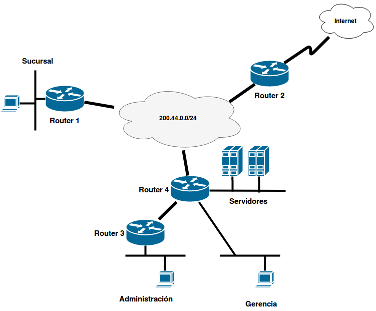

Ejercicio de Ruteo Dinámico con Netkit
======================================

Una organización está vinculada con su sucursal a través de un proveedor de servicios de conectividad el cual -además- le brinda acceso a Internet. Dicho proveedor interconecta a sus clientes a través de una red propia (nube), que utiliza el bloque de direcciones IP `200.44.0.0` con máscara `255.255.255.0`. A su empresa le ha asignado la red `200.14.32.0` con máscara `255.255.255.0`. La Figura 1 representa gráficamente la topología de la red de la organización.

Con esta información usted debe especificar, en un laboratorio de Netkit, la configuración que permita que la Casa Central se comunique con la Sucursal y mantenga conectividad completa en sus redes internas. Luego, se permita acceso a Internet a la Gerencia, los Servidores (los cuales prestan servicios al exterior) y a la Sucursal.

- Asigne las direcciones de red a las interfaces de todos los dispositivos.
- Las tablas de rutas de los ruteadores deben ser completadas utilizando algún protocolo de ruteo dinámico (RIP / OSPF).
- Escriba las tablas de rutas finales de un dispositivo de cada red y de los routers 1, 3 y 4.
- Como resolución, entregue un informe con las respuestas a estas consignas y con el laboratorio de Netkit (comprimido) listo para ser iniciado en una instalación de Netkit.

{ width=100% }

#### Notas para ayudantes

A partir de la explicación de Tomás:

La clase de Ruteo se divide usualmente en tres partes:

  - Presentación básica de Netkit y explicación de cómo se arma un laboratorio (eso lleva un rato);

  - Explicación de ruteo dinámico con RIP y OSPF utilizando zebra/quagga

  - Utilización de un laboratorio básico (slide oficial de Netkit, de 21 paginas) <http://wiki.netkit.org/netkit-labs/netkit-labs_basic-topics/netkit-lab_rip/netkit-lab_rip.pdf>

    En ese caso se levanto por proyector el labo oficial y se siguieron las cosas de la slide al pie de la letra:<http://wiki.netkit.org/netkit-labs/netkit-labs_basic-topics/netkit-lab_rip/netkit-lab_rip.tar.gz>

    Sin embargo, por los cambios en nuestro "netkit" ese laboratorio tal como está no funciona por temas de rutas a binarios, directorios que no están creados y permisos. Creo que se usó el que esta colgado de la web de TyR: <http://www.labredes.unlu.edu.ar/sites/www.labredes.unlu.edu.ar/files/site/data/tyr/netkit-lab_rip-TYR.tar.gz>, que es idéntico al de las slides en cuanto a topo logia y configuración (por ahí cambia algún directorio).

Una vez finalizado eso, se les entrega este práctico (armado por Tomás para 2018, con OK de Gabriel). Cito las palabras de Tomás:
​
> Ese ejercicio es inventado por mi 100% (basado en alguno viejo de TyR). Si detectan errores o alguna mejora siéntanse libres agregarlas.

> La idea era que armen el laboratorio de Netkit desde cero, y ese era el entregable. El ejercicio no fue obligatorio el año pasado (2017) y nadie lo entregó. Desconozco la obligatoriedad del mismo para 2018.

> La clase así parece corta, pero tenía al principio la explicación de cómo se arma un labo de Netkit, que según entiendo, ya lo vieron al principio de la cursada esta vez. Igual el labo les va a llevar un rato asi que para el resto de la clase les alcanza. (Yo cuando lo redacté, lo armé y me llevo un rato armar los archivos y eso)

#### --- Fin notas para ayudantes ---
